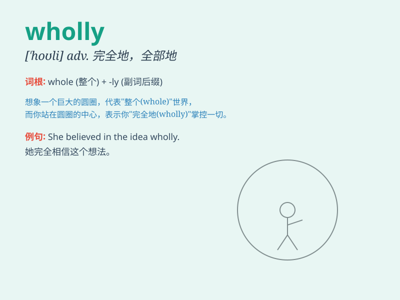

## wholly

**英音:** _[\'həʊllɪ; \'həʊlɪ]_ **美音:** _[\'holli]_

**译义:** *adv.整个,统统,全部,专门地*

### 短语

+ **wholly owned:** _全资拥有的_

+ **wholly different:** _完全不同的_

+ **wholly new:** _全新的_

+ **wholly dependent:** _完全依赖的_

+ **wholly unacceptable:** _完全不能接受的_

### 例句

#### 例句1

> **The decision was wholly unjust.**

**中文翻译:** 这个决定完全不公平。

**单词释义:** 完全地；全部地

#### 例句2

> **I wholly agree with you.**

**中文翻译:** 我完全同意你的看法。

**单词释义:** 完全；统统

#### 例句3

> **His actions were wholly without excuse.**

**中文翻译:** 他的行为完全不可原谅。

**单词释义:** 整个；全部

### 背诵小故事

> Once upon a time, a king wanted to build a wholly new castle. But it
was very difficult. Finally, with the efforts of all, a perfect new
castle was built. Here, \'wholly\' means completely or entirely.

**从前，有个国王想要建造一座全新的城堡。但这非常困难。最终，在所有人的努力下，一座完美的全新城堡建成了。这里，'wholly'意思是完全地，全部地。**

### 图义

