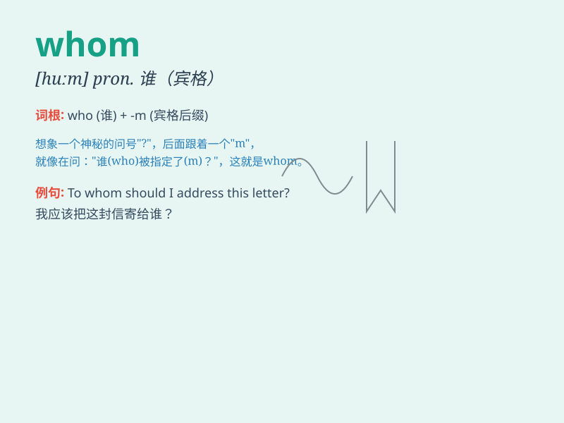

## whom

**英音:** _[huːm]_ **美音:** _[hum]_

**译义:** * pron.谁*

### 短语

+ **To whom:** _对谁；给谁_

+ **From whom:** _从谁那里_

+ **With whom:** _和谁_

+ **For whom:** _为谁_

+ **Whomsoever:** _无论是谁_

### 例句

#### 例句1

> **To whom did you give the book?**

**中文翻译:** 你把这本书给了谁？

**单词释义:** 谁（作宾语）

#### 例句2

> **Whom are you waiting for?**

**中文翻译:** 你在等谁？

**单词释义:** 谁（作宾语）

#### 例句3

> **By whom was the window broken?**

**中文翻译:** 窗户被谁打破了？

**单词释义:** 谁（作介词宾语）

### 背诵小故事

> One day, a little girl was lost. People asked, \'Whom are you looking
for?\' She answered, \'I\'m looking for my mother.\' \'Whom\' here is
used to ask about the person being sought.

**有一天，一个小女孩迷路了。人们问：'你在找谁？'
她回答：'我在找我妈妈。' 这里的'whom'用于询问被寻找的人。**

### 图义

