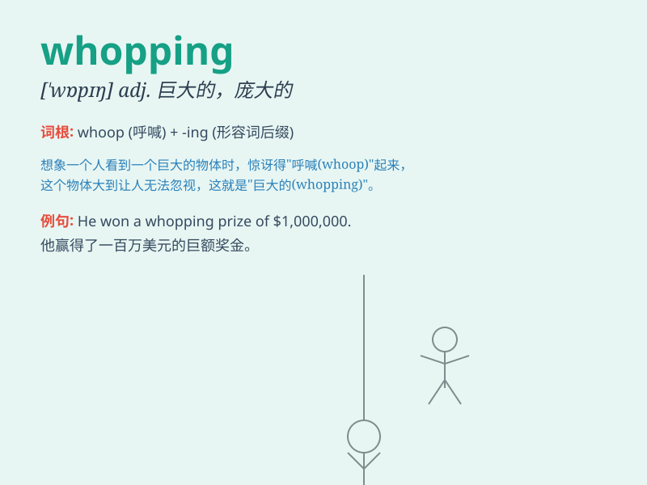

## whopping

**英音:** _[ˈwɒpɪŋ]_ **美音:** _[ˈwɑːpɪŋ]_

**译义:** *adj.巨大的,庞大的adv.非常地,异常地*

### 短语

+ **whopping debt:** _巨额债务_

+ **whopping increase:** _巨大的增长_

+ **whopping sum:** _巨额款项_

+ **whopping profit:** _巨额利润_

+ **whopping mistake:** _极大的错误_

### 例句

#### 例句1

> **The company made a whopping profit of \$10 million last year.**

**中文翻译:** 这家公司去年获得了高达 1000 万美元的利润。

**单词释义:** 巨大的；庞大的

#### 例句2

> **She received a whopping bill for her medical treatment.**

**中文翻译:** 她收到了一份巨额的医疗费用账单。

**单词释义:** 极大的；惊人的

#### 例句3

> **The new stadium has a whopping capacity of 80,000 people.**

**中文翻译:** 新体育场有多达 8 万人的巨大容量。

**单词释义:** 庞大的；很大的

### 背诵小故事

> A little boy was at the fair and saw a whopping big balloon. It was
so huge that it took up most of the sky. He was amazed and shouted,
\'Look at that whopping balloon!\'

**一个小男孩在集市上看到一个巨大的气球。它是如此之大，占据了大部分天空。他惊讶地喊道："看那个巨大的气球！"**

### 图义

