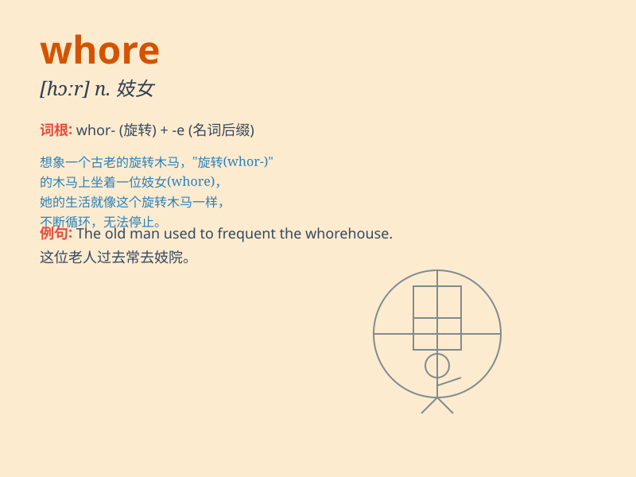

## whore

**英音:** _[hɔː]_ **美音:** _[hɔr]_

**译义:** *n.娼妓vi.卖淫*

### 短语

+ **street whore:** _街头妓女_

+ **common whore:** _普通妓女_

+ **professional whore:** _职业妓女_

+ **male whore:** _男妓_

+ **young whore:** _年轻的妓女_

### 例句

#### 例句1

> **She was accused of being a whore by her enemies.**

**中文翻译:** 她被她的敌人指责为妓女。

**单词释义:** 妓女；淫妇

#### 例句2

> **Don\'t act like a whore in public.**

**中文翻译:** 别在公共场合表现得像个荡妇。

**单词释义:** 荡妇；行为不检点的女人

#### 例句3

> **He called her a whore out of anger.**

**中文翻译:** 他生气地称她为妓女。

**单词释义:** 妓女；不道德的女人

### 背诵小故事

> A man was walking in a dark alley. Suddenly, a woman dressed
strangely approached him and asked for money in a seductive way. He
realized she was a whore.

**一个男人正在黑暗的小巷里走着。突然，一个穿着奇怪的女人以诱人的方式向他靠近并要钱。他意识到她是个妓女。**

### 图义

