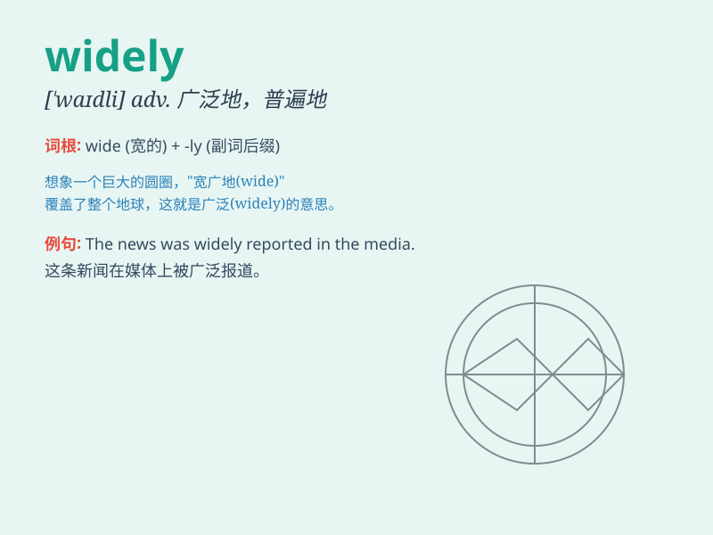

## widely

**英音:** _[\'waɪdlɪ]_ **美音:** _[\'waɪdli]_

**译义:** *adv.广泛地,普遍地,广博地,相差大地*

### 短语

+ **widely known:** _广为人知_

+ **widely used:** _广泛使用_

+ **widely spread:** _广泛传播_

+ **widely accepted:** _被广泛接受_

+ **widely different:** _大不相同_

### 例句

#### 例句1

> **English is widely spoken around the world.**

**中文翻译:** 英语在世界各地被广泛使用。

**单词释义:** 广泛地

#### 例句2

> **The news was widely spread.**

**中文翻译:** 这则新闻被广泛传播。

**单词释义:** 广泛地

#### 例句3

> **This method is widely accepted in the scientific community.**

**中文翻译:** 这种方法在科学界被广泛接受。

**单词释义:** 广泛地

### 背诵小故事

> A young scientist\'s discovery was widely recognized. At first, only
a few knew. But as news spread, it was known far and wide. People from
different places praised his work, making the word \'widely\' easy to
remember as meaning extensively or in a large scope.

**一位年轻科学家的发现得到了广泛认可。起初，只有少数人知道。但随着消息传播，它被广泛知晓。来自不同地方的人称赞他的工作，使'widely'这个词容易被记住，意思是广泛地、大范围地。**

### 图义

