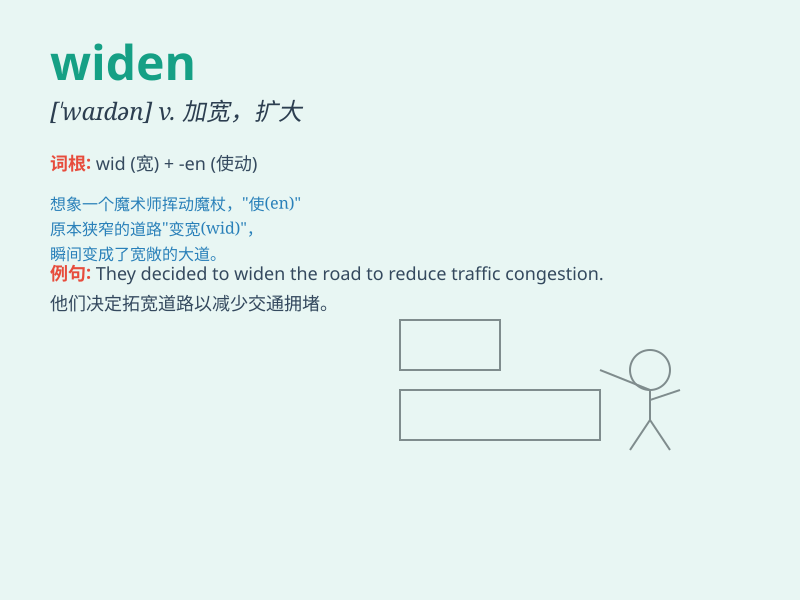

## widen

**英音:** _[\'waɪd(ə)n]_ **美音:** _[\'waɪdn]_

**译义:** *v.加宽,放宽,扩展*

### 短语

+ **widen the gap:** _扩大差距_

+ **widen one\'s knowledge:** _拓宽某人的知识面_

+ **widen the road:** _拓宽道路_

+ **widen one\'s horizons:** _开阔某人的视野_

+ **widen the scope:** _扩大范围_

### 例句

#### 例句1

> **The road is being widened to ease traffic congestion.**

**中文翻译:** 这条路正在拓宽以缓解交通拥堵。

**单词释义:** 拓宽

#### 例句2

> **His eyes widened in surprise.**

**中文翻译:** 他惊讶得睁大了眼睛。

**单词释义:** 睁大

#### 例句3

> **The gap between the rich and the poor continues to widen.**

**中文翻译:** 贫富差距继续拉大。

**单词释义:** 拉大

### 背诵小故事

> One day, a narrow path in the forest was causing trouble for
everyone. So, workers came and used tools to widen it. Now, people and
animals could pass through easily and happily.

**一天，森林里的一条狭窄小路给大家带来了麻烦。于是，工人们来了，用工具把它拓宽。现在，人和动物都能轻松愉快地通过了。**

### 图义

