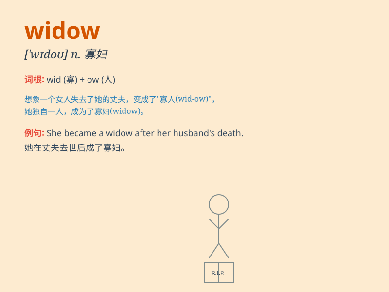

## widow

**英音:** _[\'wɪdəʊ]_ **美音:** _[\'wɪdo]_

**译义:** *n.寡妇v.使成寡妇(或鳏夫)*

### 短语

+ **grass widow:** _离婚的女子；被抛弃的女子_

+ **widow\'s peak:** _美人尖（额头顶部发际线呈 V 形）_

+ **widow\'s mite:** _寡妇的小钱（指虽少却出自真心的捐献）_

+ **window\'s weeds:** _寡妇的丧服_

+ **rich widow:** _富有的寡妇_

### 例句

#### 例句1

> **The widow was left alone with her children after her husband\'s
death.**

**中文翻译:** 在她丈夫去世后，这位寡妇独自一人带着她的孩子们。

**单词释义:** 寡妇

#### 例句2

> **The old man married a widow last year.**

**中文翻译:** 这位老人去年娶了一位寡妇。

**单词释义:** 寡妇

#### 例句3

> **The charity provided support to the widows and orphans.**

**中文翻译:** 这个慈善机构为寡妇和孤儿提供了支持。

**单词释义:** 寡妇

### 背诵小故事

> Once upon a time, there was a woman whose husband died in a war. She
became a widow. But with time and strength, she learned to live
independently and happily again.

**从前，有一个女人，她的丈夫在战争中去世了。她变成了寡妇。但随着时间推移和自身的坚强，她再次学会了独立且快乐地生活。**

### 图义

