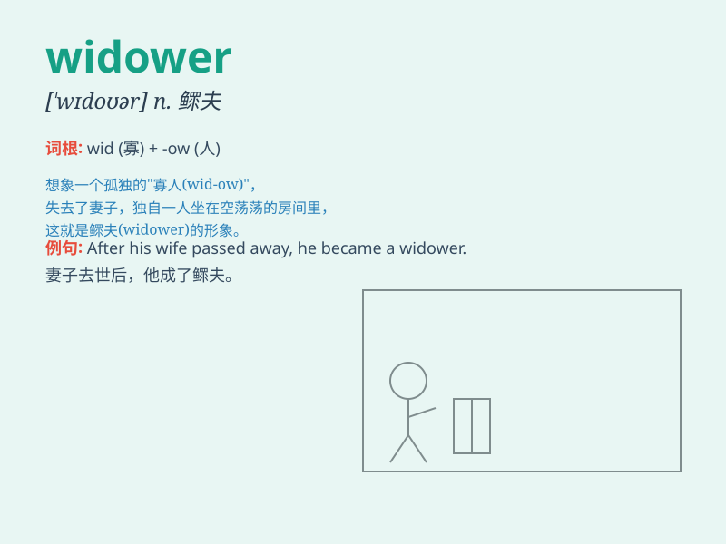

## widower

**英音:** _[\'wɪdəʊə]_ **美音:** _[\'wɪdoɚ]_

**译义:** *n.鳏夫*

### 短语

+ **elderly widower:** _年长的鳏夫_

+ **recent widower:** _新鳏夫_

+ **lonely widower:** _孤独的鳏夫_

+ **wealthy widower:** _富有的鳏夫_

+ **kind-hearted widower:** _善良的鳏夫_

### 例句

#### 例句1

> **He became a widower when his wife passed away last year.**

**中文翻译:** 他的妻子去年去世后，他成了鳏夫。

**单词释义:** 鳏夫

#### 例句2

> **The widower struggled to cope with the loss of his partner.**

**中文翻译:** 这位鳏夫努力应对失去伴侣的痛苦。

**单词释义:** 鳏夫

#### 例句3

> **After years as a widower, he finally found love again.**

**中文翻译:** 当了多年鳏夫后，他终于再次找到了爱情。

**单词释义:** 鳏夫

### 背诵小故事

> A widower was a man who lost his beloved wife. One day, he sat alone
in their garden, remembering the happy times. But with time, he found
the strength to move forward, knowing his wife would want him to be
happy.

**一位鳏夫失去了他心爱的妻子。有一天，他独自坐在他们的花园里，回忆着那些快乐的时光。但随着时间的推移，他找到了前进的力量，因为他知道妻子希望他快乐。**

### 图义

