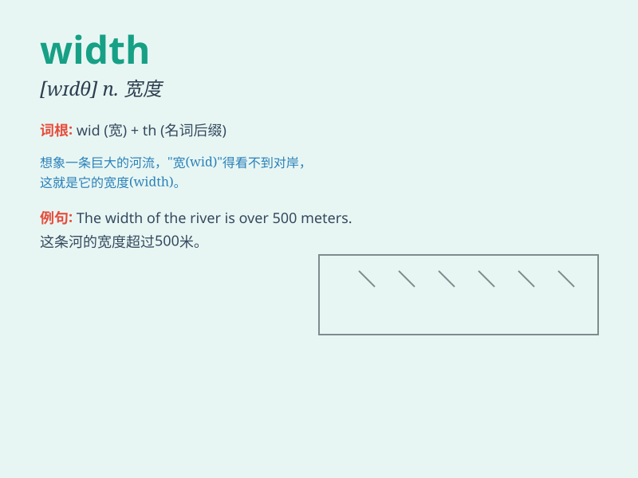

## width

**英音:** _[wɪtθ; wɪdθ]_ **美音:** _[wɪdθ]_

**译义:** *n.宽度,宽广,广博,有一定宽度的东西(如一快布料等)
/n.宽/高比*

### 短语

+ **width of:** _\...\...的宽度_

+ **full width:** _全宽；整个宽度_

+ **in width:** _在宽度方面_

+ **width measurement:** _宽度测量_

+ **average width:** _平均宽度_

### 例句

#### 例句1

> **The width of the table is 80 centimeters.**

**中文翻译:** 这张桌子的宽度是 80 厘米。

**单词释义:** 宽度

#### 例句2

> **The river is 50 meters in width.**

**中文翻译:** 这条河宽 50 米。

**单词释义:** 宽度

#### 例句3

> **The width of the road needs to be expanded.**

**中文翻译:** 这条路的宽度需要拓宽。

**单词释义:** 宽度

### 背诵小故事

> One day, a little ant was trying to cross a river. But the bridge was
too narrow. It needed a wider one. Then it realized \'width\' means the
measurement of how wide something is.

**有一天，一只小蚂蚁试图过河。但桥太窄了。它需要更宽的桥。然后它意识到\'width\'指的是某物有多宽的度量。**

### 图义

