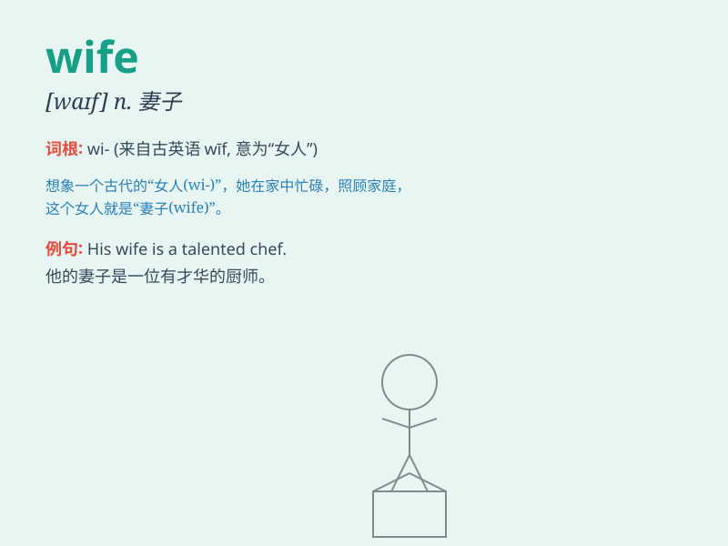

## wife

**英音:** _[waɪf]_ **美音:** _[waɪf]_

**译义:** *n.妻子*

### 短语

+ **ex-wife:** _前妻_

+ **housewife:** _家庭主妇_

+ **working wife:** _有工作的妻子_

+ **wife and children:** _妻儿_

+ **devoted wife:** _忠诚的妻子_

### 例句

#### 例句1

> **He loves his wife deeply.**

**中文翻译:** 他深深地爱着他的妻子。

**单词释义:** 妻子

#### 例句2

> **My wife is a great cook.**

**中文翻译:** 我的妻子是个很棒的厨师。

**单词释义:** 妻子

#### 例句3

> **He bought a gift for his wife on her birthday.**

**中文翻译:** 在他妻子生日那天，他给她买了一份礼物。

**单词释义:** 妻子

### 背诵小故事

> A man was lost in a forest. He was very scared and hungry. But his
wife never gave up looking for him. Finally, she found him and they
hugged tightly. Wife means the woman you are married to.

**一个男人在森林里迷路了。他又害怕又饥饿。但他的妻子从未放弃寻找他。最后，她找到了他，他们紧紧相拥。wife
意思是与你结婚的女人。**

### 图义

