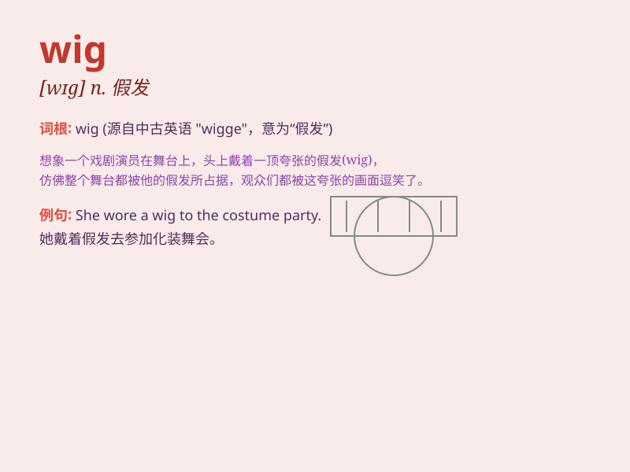

## wig

**英音:** _[wɪg]_ **美音:** _[wɪɡ]_

**译义:** *n.假发；蓄意的行动vt.用假发装饰；使戴假发*

### 短语

+ **wig out:** _变得狂热；激动_

+ **wear a wig:** _戴假发_

+ **long wig:** _长假发_

+ **short wig:** _短假发_

+ **curly wig:** _卷发假发_

### 例句

#### 例句1

> **She wore a long black wig to the party.**

**中文翻译:** 她戴着一顶长长的黑色假发去参加聚会。

**单词释义:** 假发

#### 例句2

> **The actress changed her appearance with a blonde wig.**

**中文翻译:** 这位女演员用一顶金色的假发改变了她的外貌。

**单词释义:** 假发

#### 例句3

> **He took off his wig and revealed his bald head.**

**中文翻译:** 他摘下假发，露出了光头。

**单词释义:** 假发

### 背诵小故事

> One day, a little girl was very sad because she lost her hair. But
then, her mother gave her a beautiful wig. She wore it and felt happy
again. The wig became her favorite thing.

**有一天，一个小女孩非常伤心，因为她掉了头发。但后来，她的妈妈给了她一顶漂亮的假发。她戴上它，又感到开心了。这顶假发成了她最喜欢的东西。**

### 图义

