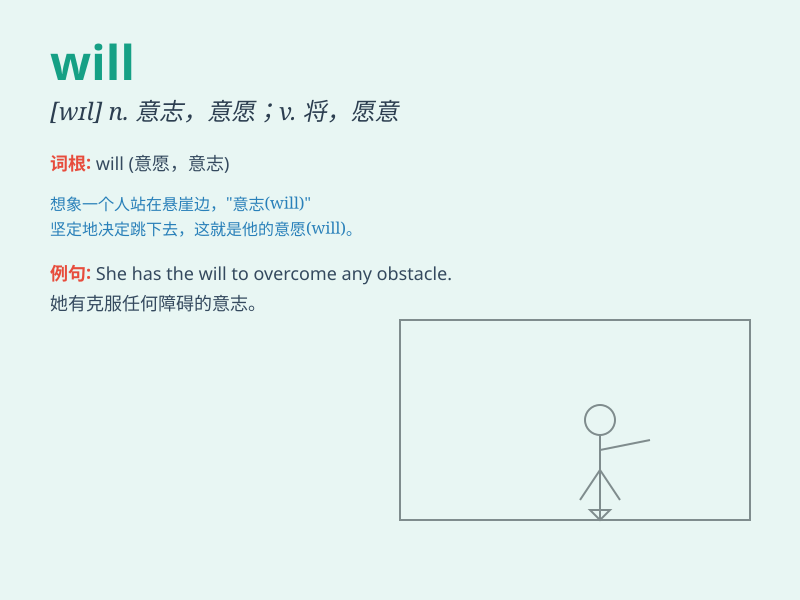

## will

**英音:** _[wɪl]_ **美音:** _[wɪl]_

**译义:** *n.意志,决心,意向,遗嘱v.aux.将,愿意,必须*

### 短语

+ **will power:** _意志力；毅力_

+ **good will:** _善意；友好；亲善_

+ **will do:** _行；好的；没问题_

+ **free will:** _自由意志；自愿_

+ **at will:** _随意；任意_

### 例句

#### 例句1

> **I will go to the park tomorrow.**

**中文翻译:** 我明天将会去公园。

**单词释义:** 将会；将要

#### 例句2

> **She will help you if you ask her.**

**中文翻译:** 如果你请求她，她将会帮助你。

**单词释义:** 将会；将要

#### 例句3

> **Will you come to my party?**

**中文翻译:** 你会来我的聚会吗？

**单词释义:** 会；愿意

### 背诵小故事

> A young boy named Tom was lost in a forest. He was scared but had the
will to find his way out. He kept walking, believing in his
determination. Finally, he succeeded. The will here means the
determination to do something.

**一个叫汤姆的小男孩在森林里迷路了。他很害怕，但有走出去的意愿。他一直走，相信自己的决心。最后，他成功了。这里的will指的是做某事的决心。**

### 图义

