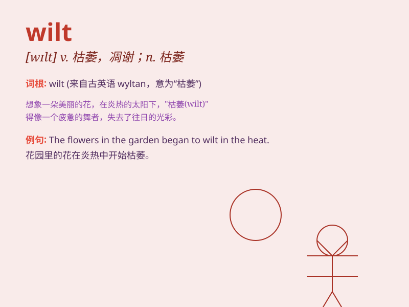

## wilt

**英音:** _[wɪlt]_ **美音:** _[wɪlt]_

**译义:** *v.(使)枯萎,(使)憔悴,(使)畏缩n.枯萎,憔悴,畏缩*

### 短语

+ **wilt away:** _枯萎；凋谢_

+ **wilt under pressure:** _在压力下萎靡不振_

+ **wilt disease:** _枯萎病_

+ **begin to wilt:** _开始枯萎_

+ **wilt easily:** _容易枯萎_

### 例句

#### 例句1

> **The flowers wilted in the hot sun.**

**中文翻译:** 这些花在炎热的太阳下枯萎了。

**单词释义:** 枯萎；凋谢

#### 例句2

> **His spirits wilted at the bad news.**

**中文翻译:** 听到这个坏消息，他的精神萎靡了。

**单词释义:** 变得萎靡；消沉

#### 例句3

> **The lettuce wilts quickly if not stored properly.**

**中文翻译:** 生菜如果储存不当会很快枯萎。

**单词释义:** 枯萎；蔫

### 背诵小故事

> A beautiful flower was blooming in the garden. But as the hot sun
shone fiercely, it started to wilt. Its petals drooped and lost their
vitality. Poor flower! \'Wilt\' means to become weak and droop.

**一朵美丽的花在花园里盛开。但当烈日炎炎时，它开始枯萎。它的花瓣低垂，失去了活力。可怜的花！\'wilt\'意思是变得虚弱和低垂。**

### 图义

