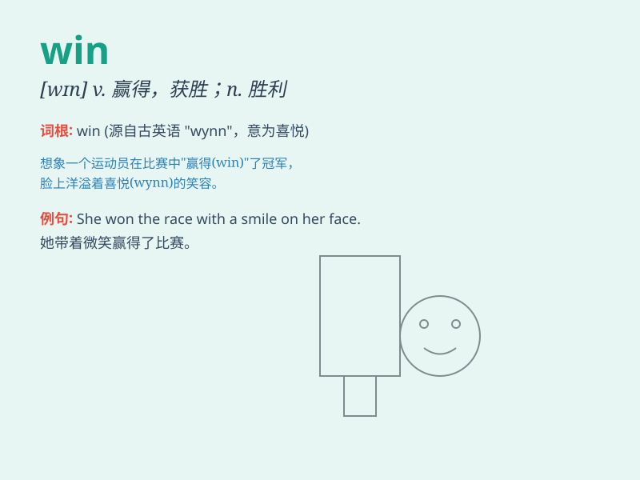

## win

**英音:** _[wɪn]_ **美音:** _[wɪn]_

**译义:** *v.(获)胜,赢得,劝诱,取得胜利n.赢,胜利*

### 短语

+ **win over:** _说服，把...争取过来_

+ **win out:** _最终获胜；摆脱困境_

+ **win through:** _最终获得成功；克服困难_

+ **win back:** _重新获得；赢回_

+ **win at:** _在...中获胜_

### 例句

#### 例句1

> **He finally won the game.**

**中文翻译:** 他最终赢得了比赛。

**单词释义:** 赢得

#### 例句2

> **She won the first prize in the competition.**

**中文翻译:** 她在比赛中获得了一等奖。

**单词释义:** 获得

#### 例句3

> **Our team won by a narrow margin.**

**中文翻译:** 我们队以微弱优势获胜。

**单词释义:** 获胜

### 背诵小故事

> One day, Tom participated in a running race. Despite facing strong
opponents, he ran as fast as he could. Finally, he crossed the finish
line first and won the championship. Everyone cheered for him.

**一天，汤姆参加了一场跑步比赛。尽管面对强劲的对手，他尽全力奔跑。最终，他第一个冲过终点线，赢得了冠军。大家都为他欢呼。**

### 图义

