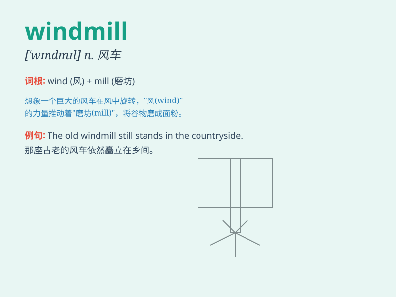

## windmill

**英音:** _[\'wɪn(d)mɪl]_ **美音:** _[\'wɪnd\'mɪl]_

**译义:** *n.风车,风车房,旋转玩具vt.使旋转vi.作风车般旋转*

### 短语

+ **windmill farm:** _风力发电场_

+ **windmill blade:** _风车叶片_

+ **traditional windmill:** _传统风车_

+ **windmill tower:** _风车塔_

+ **modern windmill:** _现代风车_

### 例句

#### 例句1

> **The windmill is turning slowly in the gentle breeze.**

**中文翻译:** 风车在微风中缓慢地转动。

**单词释义:** 风车

#### 例句2

> **We visited an old windmill that was used to grind grain.**

**中文翻译:** 我们参观了一座用于磨谷物的旧风车。

**单词释义:** 风车

#### 例句3

> **The children were fascinated by the colorful windmill on the top
of the hill.**

**中文翻译:** 孩子们被山顶上那色彩斑斓的风车吸引住了。

**单词释义:** 风车

### 背诵小故事

> One day, a little boy was lost in a field. Suddenly, he saw a
windmill. The big blades of the windmill were turning quickly in the
wind. It was like a magical machine that led him home.

**有一天，一个小男孩在田野里迷路了。突然，他看到了一个风车。风车的大叶片在风中快速转动。它就像一个神奇的机器，引领他回了家。**

### 图义

