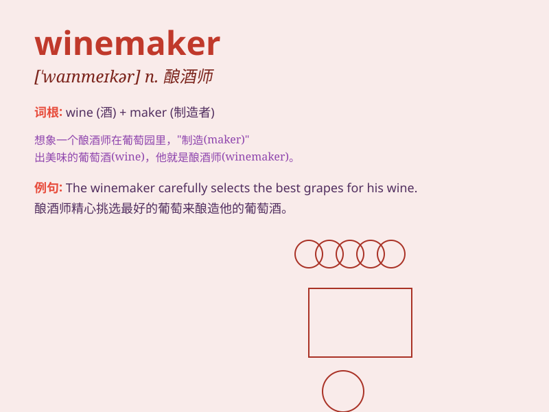

## winemaker

**英音:** _[ˈwɪnmeɪkə(r)]_ **美音:** _[ˈwɪnmeɪkər]_

**译义:** *n.葡萄酒酿造者；酿酒商*

### 短语

+ **expert winemaker:** _专业的酿酒师_

+ **famous winemaker:** _著名的酿酒师_

+ **local winemaker:** _当地的酿酒师_

+ **traditional winemaker:** _传统的酿酒师_

+ **talented winemaker:** _有才华的酿酒师_

### 例句

#### 例句1

> **The winemaker carefully selected the grapes for the best
wine.**

**中文翻译:** 这位酿酒师精心挑选葡萄以酿造出最好的葡萄酒。

**单词释义:** 酿酒师

#### 例句2

> **The renowned winemaker has won many awards for his creations.**

**中文翻译:** 这位著名的酿酒师因其作品赢得了许多奖项。

**单词释义:** 酿酒师

#### 例句3

> **The young winemaker is passionate about her craft.**

**中文翻译:** 这位年轻的酿酒师对她的手艺充满热情。

**单词释义:** 酿酒师

### 背诵小故事

> Once upon a time, there was a man named Tom. He had a passion for
making wine and was known as a great winemaker. He carefully selected
grapes and used his secret techniques to create delicious wines that
everyone loved.

**从前，有个叫汤姆的人。他热衷于酿酒，被称为出色的酿酒师。他精心挑选葡萄，并用他的秘密技术酿造出人人喜爱的美味葡萄酒。**

### 图义

