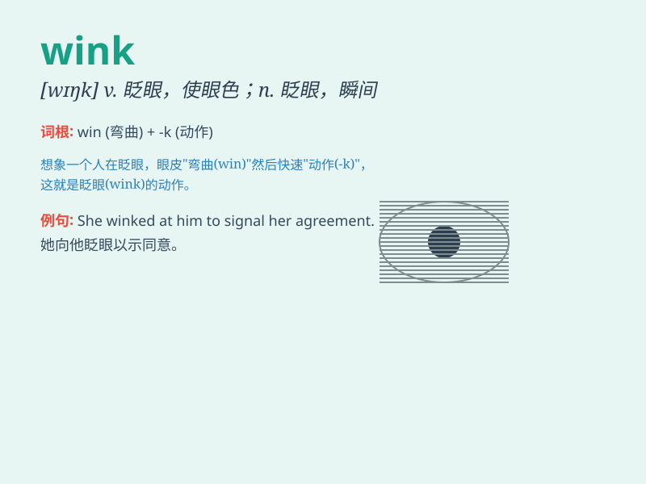

## wink

**英音:** _[wɪŋk]_ **美音:** _[wɪŋk]_

**译义:**
*n.眨眼,使眼色,瞬间,(星光等的)闪烁vi.眨眼,使眼色,闪烁,打信号,假装不见,终止,熄灭vt.眨(眼)*

### 短语

+ **wink at:** _向\...眨眼；假装没看见_

+ **give someone a wink:** _向某人眨眼_

+ **wink out:** _熄灭；消失_

+ **sleep wink:** _眨眼间的睡眠；极短时间的睡眠_

+ **wink of an eye:** _眨眼之间；瞬间_

### 例句

#### 例句1

> **She gave me a friendly wink as she passed by.**

**中文翻译:** 她路过时友好地向我眨了眨眼。

**单词释义:** 眨眼；使眼色

#### 例句2

> **The star winked at us from the sky.**

**中文翻译:** 那颗星星在天空中对我们闪烁。

**单词释义:** 闪烁

#### 例句3

> **He managed to wink the news to his friend.**

**中文翻译:** 他设法向他的朋友眨眼暗示这个消息。

**单词释义:** 眨眼示意；暗示

### 背诵小故事

> One night, I was walking alone in a dark alley. Suddenly, a
mysterious figure appeared and gave me a wink. It was as if that wink
was a secret signal, making me both curious and a little scared.

**一天晚上，我独自走在一条黑暗的小巷里。突然，一个神秘的身影出现并向我眨了眨眼。仿佛那个眨眼是一个秘密信号，让我既好奇又有点害怕。**

### 图义

