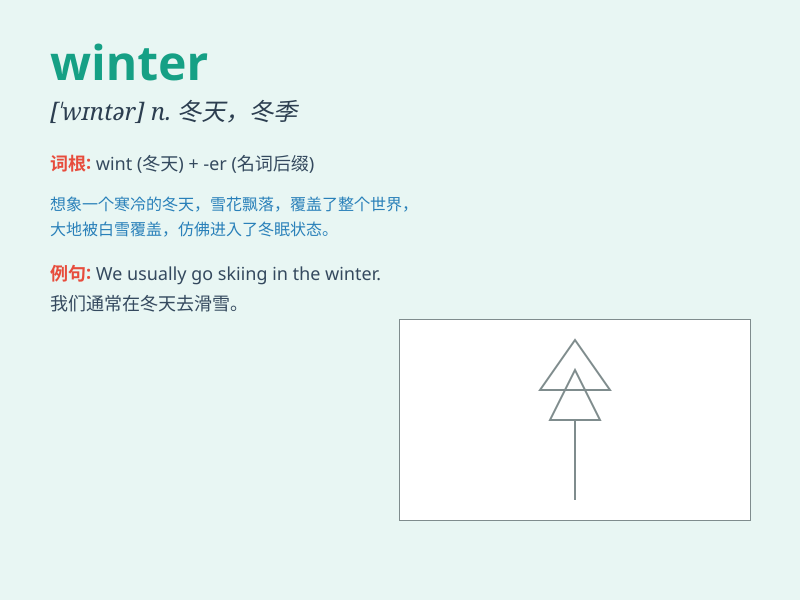

## winter

**英音:** _[\'wɪntə]_ **美音:** _[\'wɪntɚ]_

**译义:**
*n.冬,冬季,萧条期,衰退期adj.冬天的vt.对\...进行冬天保护vi.过冬*

### 短语

+ **winter coat:** _冬衣_

+ **winter sports:** _冬季运动_

+ **winter vacation:** _寒假_

+ **winter solstice:** _冬至_

+ **harsh winter:** _严寒的冬天_

### 例句

#### 例句1

> **I love the quietness of winter.**

**中文翻译:** 我喜欢冬天的宁静。

**单词释义:** 冬天

#### 例句2

> **We often go skiing in winter.**

**中文翻译:** 我们经常在冬天去滑雪。

**单词释义:** 冬天

#### 例句3

> **The trees are bare in winter.**

**中文翻译:** 树木在冬天光秃秃的。

**单词释义:** 冬天

### 背诵小故事

> In winter, a little bear curls up in its cave to sleep. The world
outside is covered with white snow. It\'s so cold that rivers freeze.
But the bear is warm and safe, waiting for spring.

**在冬天，一只小熊蜷缩在它的洞穴里睡觉。外面的世界被白雪覆盖。天气非常寒冷，河流都结冰了。但小熊温暖又安全，等待着春天。**

### 图义

