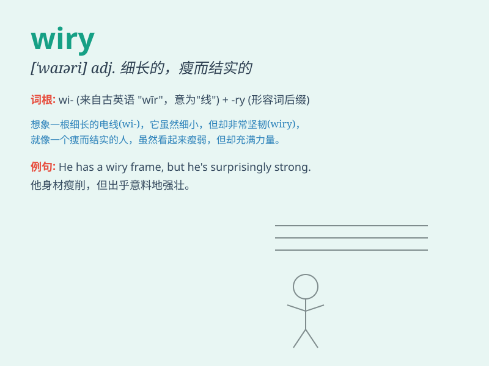

## wiry

**英音:** _[\'waɪərɪ]_ **美音:** _[\'waɪəri]_

**译义:**
*adj.金属丝的,金属线制的,铁丝似的,瘦长结实的,(嗓音)尖细的*

### 短语

+ **wiry hair:** _硬直的头发_

+ **wiry frame:** _瘦而结实的体格_

+ **wiry texture:** _坚韧的质地_

+ **wiry strength:** _结实的力量_

+ **wiry build:** _结实的体型_

### 例句

#### 例句1

> **He has a wiry build and is very strong.**

**中文翻译:** 他身材结实，非常强壮。

**单词释义:** 结实的；瘦而结实的

#### 例句2

> **The wiry texture of the rope made it difficult to cut.**

**中文翻译:** 这根绳子的质地坚硬，很难切断。

**单词释义:** 坚硬的；坚韧的

#### 例句3

> **Her wiry hair was tied back in a ponytail.**

**中文翻译:** 她硬直的头发扎成了一个马尾辫。

**单词释义:** 硬直的；像金属丝的

### 背诵小故事

> A wiry athlete was training hard. Despite being thin and not very
muscular, his wiry body was full of strength and endurance. He could run
long distances and perform difficult tasks easily.

**一位精瘦结实的运动员正在刻苦训练。尽管他身形瘦削，肌肉也不发达，但他那精瘦结实的身体充满了力量和耐力。他能够轻松地长跑和完成困难的任务。**

### 图义

