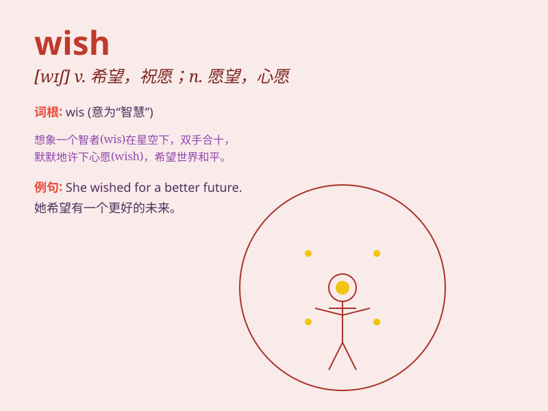

## wish

**英音:** _[wɪʃ]_ **美音:** _[wɪʃ]_

**译义:**
*n.愿望,心愿,请求,所愿望的事物,祝愿v.希望,想要,但愿,祝贺*

### 短语

+ **wish for:** _盼望；希望得到_

+ **wish sb. well:** _祝某人顺利；祝某人安好_

+ **wish list:** _愿望清单；希望清单_

+ **make a wish:** _许愿_

+ **best wishes:** _最美好的祝愿；良好的祝愿_

### 例句

#### 例句1

> **I wish I could fly.**

**中文翻译:** 我希望我能飞。

**单词释义:** 希望；愿望

#### 例句2

> **She wishes to travel around the world.**

**中文翻译:** 她希望环游世界。

**单词释义:** 希望；想要

#### 例句3

> **We wish you a happy birthday.**

**中文翻译:** 我们祝你生日快乐。

**单词释义:** 祝愿

### 背诵小故事

> A little girl named Lily always closes her eyes and makes a wish when
she sees a shooting star. She wishes to have a big dollhouse. Her wish
shows her longing and hope for something nice.

**一个叫莉莉的小女孩，每当看到流星时总会闭上眼睛许愿。她希望能拥有一个大大的玩具屋。她的愿望展现了她对美好事物的渴望和期待。**

### 图义

