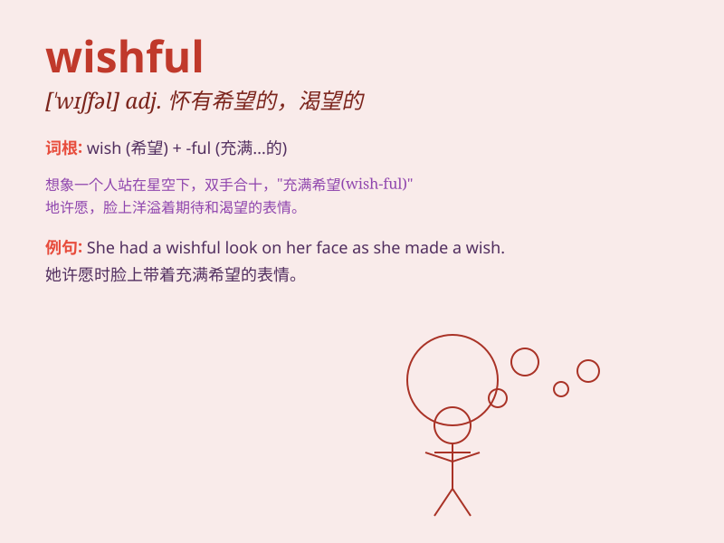

## wishful

**英音:** _[\'wɪʃfʊl; -f(ə)l]_ **美音:** _[\'wɪʃfəl]_

**译义:** *adj.想望的*

### 短语

+ **wishful thinking:** _一厢情愿的想法；如意算盘_

+ **wishful hope:** _充满希望的愿望_

+ **wishful eyes:** _充满渴望的眼神_

+ **wishful imagination:** _充满向往的想象_

+ **wishful heart:** _充满期待的心_

### 例句

#### 例句1

> **She had a wishful look in her eyes as she imagined winning the
lottery.**

**中文翻译:** 她想象着中彩票，眼中带着充满希望的神情。

**单词释义:** 充满希望的；一厢情愿的

#### 例句2

> **His wishful thinking led him to believe he could pass the exam
without studying.**

**中文翻译:** 他的一厢情愿让他认为自己不学习也能通过考试。

**单词释义:** 一厢情愿的

#### 例句3

> **The child had a wishful smile when she talked about her dream
vacation.**

**中文翻译:** 孩子谈论她梦想中的假期时露出了充满渴望的微笑。

**单词释义:** 充满渴望的

### 背诵小故事

> A young girl named Lily was always wishful. She wished to have a
magic wand to solve all problems. One day, she dreamt of getting it. But
when she woke up, she knew it was just her wishful thinking.

**一个叫莉莉的年轻女孩总是充满幻想。她希望拥有一根魔法棒来解决所有问题。有一天，她梦到得到了它。但当她醒来，她知道这只是她的一厢情愿。**

### 图义

