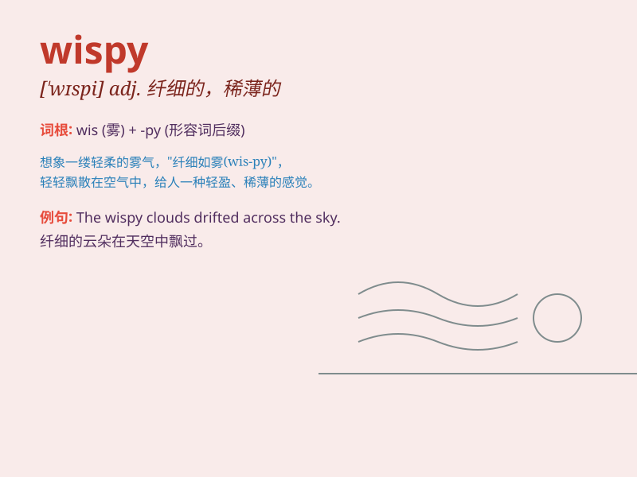

## wispy

**英音:** _[ˈwɪspi]_ **美音:** _[ˈwɪspi]_

**译义:** *adj.象小束状的,纤细的,脆弱的*

### 短语

+ **wispy cloud:** _稀薄的云_

+ **wispy hair:** _细软的头发_

+ **wispy smoke:** _缕缕青烟_

+ **wispy beard:** _稀疏的胡须_

+ **wispy fabric:** _轻薄的织物_

### 例句

#### 例句1

> **The wispy clouds floated across the sky.**

**中文翻译:** 缕缕白云飘过天空。

**单词释义:** 纤细的；稀薄的；像小缕似的

#### 例句2

> **She had wispy hair that framed her face.**

**中文翻译:** 她有一缕缕的头发环绕着脸庞。

**单词释义:** 纤细的；稀疏的

#### 例句3

> **The wispy fog hung over the valley.**

**中文翻译:** 稀薄的雾笼罩着山谷。

**单词释义:** 稀薄的；模糊的

### 背诵小故事

> A fairy was floating in the forest. Her dress was wispy, like the
soft clouds. The wispy fabric moved gently with the wind. It was so
beautiful that everyone who saw it was amazed.

**一位仙女在森林中飘浮着。她的裙子是稀薄的，就像柔软的云朵。稀薄的布料随风轻轻飘动。它是如此美丽，以至于每个看到的人都感到惊讶。**

### 图义

