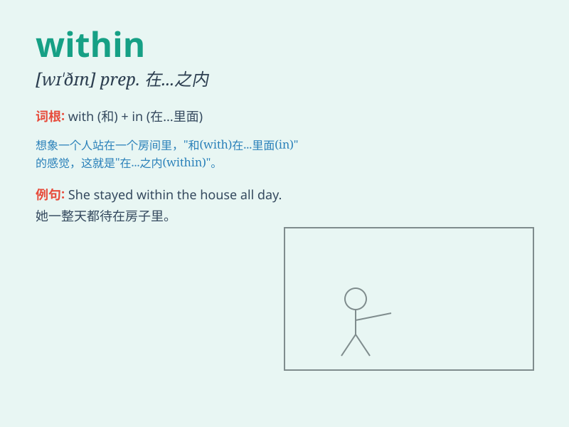

## within

**英音:** _[wɪð\'ɪn]_ **美音:** _[wɪ\'ðɪn]_

**译义:** *n.内部,里头adv.在内部,在内心里
prep.在\...之内,不越出adj.里面的,内部的*

### 短语

+ **within reach:** _够得着；在附近_

+ **within limits:** _在一定范围内；适度地_

+ **within sight:** _在视线内；在望_

+ **within oneself:** _独自地；默默地_

+ **within an ace of:** _几乎；差点儿_

### 例句

#### 例句1

> **The store is within walking distance.**

**中文翻译:** 这家商店在步行距离之内。

**单词释义:** 在\...\...之内

#### 例句2

> **You should complete the task within two days.**

**中文翻译:** 你应该在两天内完成这项任务。

**单词释义:** 在\...\...之内

#### 例句3

> **The temperature remained within the normal range.**

**中文翻译:** 温度保持在正常范围内。

**单词释义:** 在\...\...之内

### 背诵小故事

> A little mouse was lost within a big house. It searched everywhere
but couldn\'t find the exit. Finally, it discovered a small hole and
escaped. \'Within\' means inside or in the limits of.

**一只小老鼠在一个大房子里迷路了。它到处找但找不到出口。最后，它发现了一个小洞并逃了出去。\'within\'意思是在\...\...里面或在\...\...范围内。**

### 图义

