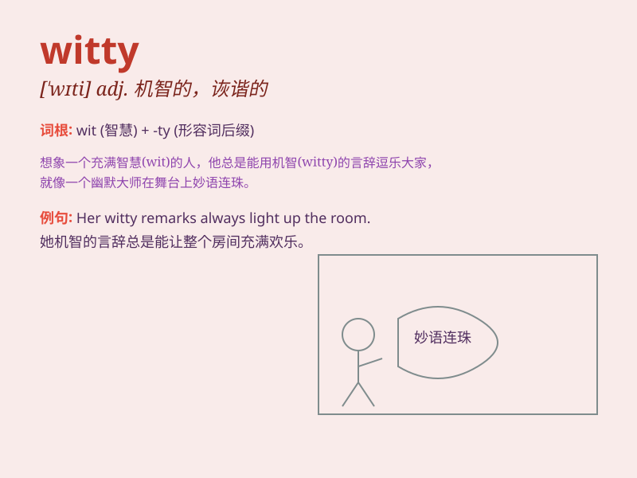

## witty

**英音:** _[\'wɪtɪ]_ **美音:** _[\'wɪti]_

**译义:** *adj.富于机智的,诙谐的*

### 短语

+ **witty remarks:** _风趣的言论_

+ **witty banter:** _诙谐的打趣_

+ **witty comeback:** _机智的回应_

+ **witty dialogue:** _妙趣横生的对话_

+ **witty humor:** _诙谐幽默_

### 例句

#### 例句1

> **She is known for her witty remarks in social gatherings.**

**中文翻译:** 她在社交聚会上以机智的言论而闻名。

**单词释义:** 机智的；诙谐的

#### 例句2

> **His witty comeback left the audience in stitches.**

**中文翻译:** 他机智的反驳让观众捧腹大笑。

**单词释义:** 诙谐幽默的

#### 例句3

> **The witty dialogue in the play made it a huge success.**

**中文翻译:** 这部剧中诙谐的对话使其大获成功。

**单词释义:** 风趣的；妙趣横生的

### 背诵小故事

> A witty monkey was playing in the forest. It could quickly come up
with smart ideas to get fruits. Its witty tricks made all the other
animals laugh. Just like this monkey, being witty means being smart and
funny in a charming way.

**一只机智的猴子在森林里玩耍。它能迅速想出聪明的主意来获取水果。它机智的小把戏让所有其他动物都大笑。就像这只猴子一样，witty
这个词意味着以迷人的方式聪明且有趣。**

### 图义

