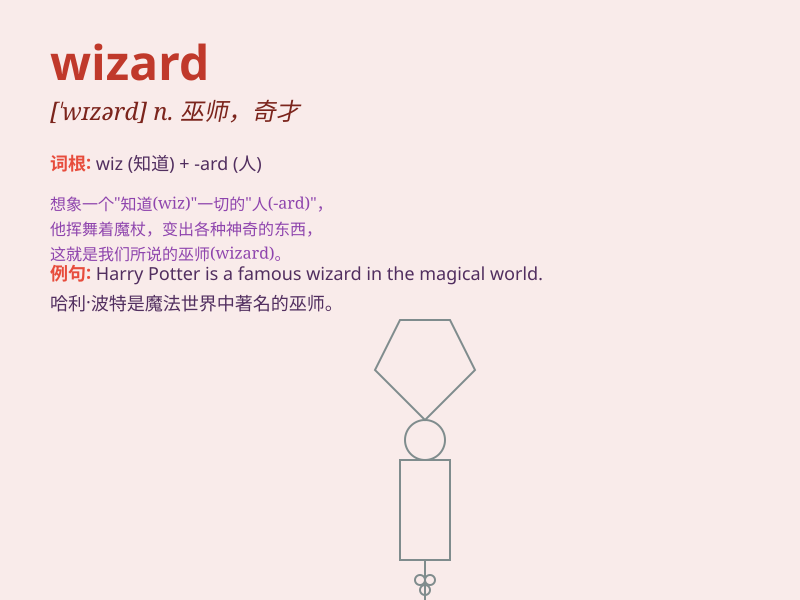

## wizard

**英音:** _[\'wɪzəd]_ **美音:** _[\'wɪzɚd]_

**译义:** *n.神汉,男巫,术士,奇才adj.男巫的,巫术的,有魔力的*

### 短语

+ **computer wizard:** _电脑奇才_

+ **wizard hat:** _巫师帽_

+ **wizard staff:** _巫师法杖_

+ **wizard robe:** _巫师长袍_

+ **dark wizard:** _黑巫师_

### 例句

#### 例句1

> **The wizard cast a powerful spell to defeat the evil dragon.**

**中文翻译:** 这位巫师施展了一个强大的法术来打败邪恶的龙。

**单词释义:** 巫师

#### 例句2

> **He is a computer wizard and can solve any technical problem
easily.**

**中文翻译:** 他是个电脑奇才，能轻松解决任何技术问题。

**单词释义:** 奇才；能手

#### 例句3

> **The new software is so user-friendly that even a wizard like me
had no trouble operating it.**

**中文翻译:**
这款新软件非常用户友好，就连像我这样的行家操作起来也毫无困难。

**单词释义:** 行家；高手

### 背诵小故事

> In a magical forest, there was a mysterious figure known as the
wizard. He had a long beard and a pointed hat. With a wave of his wand,
he could make amazing things happen. People came from far and wide to
seek his magical help.

**在一个神奇的森林里，有一个被称为巫师的神秘人物。他有长长的胡须和一顶尖帽子。他一挥魔杖，就能创造出神奇的事情。人们从四面八方赶来寻求他神奇的帮助。**

### 图义

