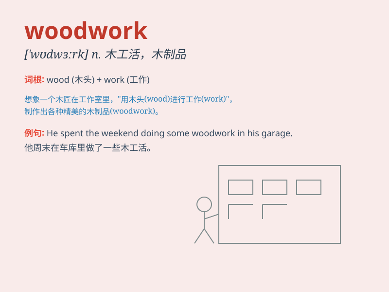

## woodwork

**英音:** _[\'wʊdwɜːk]_ **美音:** _[\'wʊd\'wɝk]_

**译义:** * 木制品,木造部份,木工手艺*

### 短语

+ **come out of the woodwork:** _突然露面；纷纷出笼_

+ **do the woodwork:** _做木工活_

+ **woodwork class:** _木工课_

+ **woodwork joint:** _木工接合处_

+ **woodwork project:** _木工项目_

### 例句

#### 例句1

> **The carpenter is skilled in woodwork.**

**中文翻译:** 这位木匠擅长木工活。

**单词释义:** 木工活；木制品

#### 例句2

> **He spent the weekend doing some woodwork in his garage.**

**中文翻译:** 他周末在车库里做一些木工活。

**单词释义:** 木工活

#### 例句3

> **The quality of the woodwork in this furniture is excellent.**

**中文翻译:** 这件家具的木工质量非常好。

**单词释义:** 木工制品

### 背诵小故事

> One day, Tom was repairing a chair in his workshop. The chair was
made of wood, and he needed to do some woodwork. He carefully sanded and
polished the wood until the chair looked perfect.

**一天，汤姆在他的工作室里修理一把椅子。这把椅子是木制的，他需要做一些木工活。他仔细地打磨和抛光木头，直到椅子看起来完美。**

### 图义

