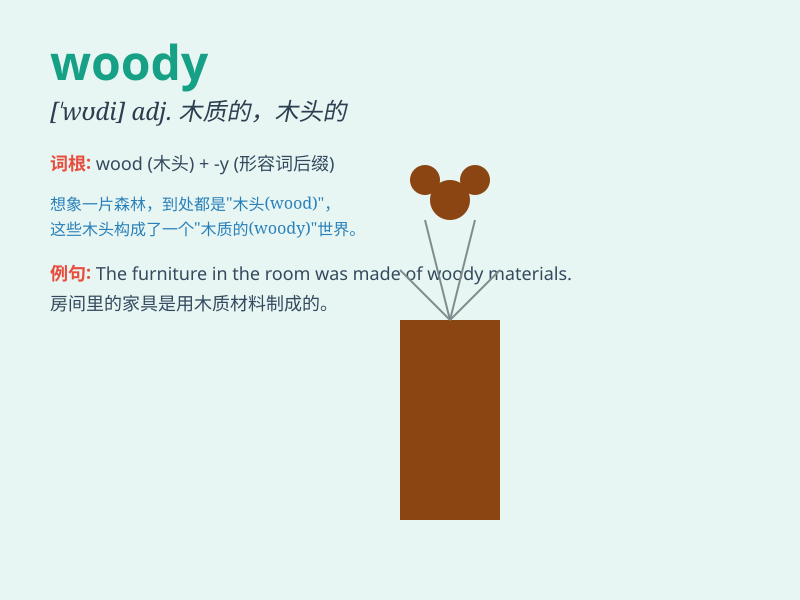

## woody

**英音:** _[\'wʊdɪ]_ **美音:** _[\'wʊdi]_

**译义:** *adj.多树木的,木本的,木头般的,木制的*

### 短语

+ **woody plant:** _木本植物_

+ **woody texture:** _木质纹理_

+ **woody area:** _树木繁茂的地区_

+ **woody scent:** _木质香味_

+ **woody stem:** _木质茎_

### 例句

#### 例句1

> **The forest was full of woody plants.**

**中文翻译:** 这片森林里满是木本植物。

**单词释义:** 木本的

#### 例句2

> **The old chair had a woody smell.**

**中文翻译:** 这把旧椅子有一股木头的气味。

**单词释义:** 木质的

#### 例句3

> **He has a woody personality and is not very sociable.**

**中文翻译:** 他性格木讷，不太善于交际。

**单词释义:** 呆板的；木讷的

### 背诵小故事

> A little rabbit was lost in a woody area. It was scared but kept
looking for a way out. Finally, it found a path and returned home
safely. Remember, \'woody\' means full of trees or like a forest.

**一只小兔子在树木繁茂的地区迷路了。它很害怕，但一直在寻找出路。最后，它找到了一条小路并安全回家。记住，\'woody\'意思是树木繁茂的或像森林的。**

### 图义

