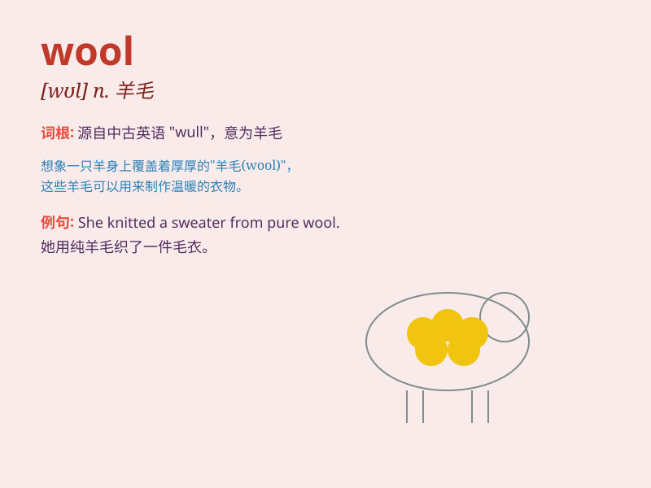

## wool

**英音:** _[wʊl]_ **美音:** _[wʊl]_

**译义:** *n.羊毛,毛织品,毛线,绒线,毛料衣物*

### 短语

+ **wool sweater:** _羊毛衫_

+ **pure wool:** _纯羊毛_

+ **wool fabric:** _羊毛织物_

+ **wool coat:** _羊毛大衣_

+ **wool spinning:** _羊毛纺纱_

### 例句

#### 例句1

> **This sweater is made of pure wool.**

**中文翻译:** 这件毛衣是由纯羊毛制成的。

**单词释义:** 羊毛

#### 例句2

> **She has a scarf of soft wool.**

**中文翻译:** 她有一条柔软的羊毛围巾。

**单词释义:** 羊毛

#### 例句3

> **The sheep provides us with wool.**

**中文翻译:** 这只羊为我们提供羊毛。

**单词释义:** 羊毛

### 背诵小故事

> One cold winter day, a little lamb was shivering. The farmer came and
took its soft wool to make warm clothes. The wool protected people from
the cold. Remember, wool is the soft hair of sheep used for making warm
things.

**在一个寒冷的冬日，一只小羊羔冻得发抖。农夫过来取走了它柔软的羊毛去制作温暖的衣物。羊毛保护人们抵御寒冷。记住，wool
就是羊身上用于制作温暖物品的柔软毛发。**

### 图义

