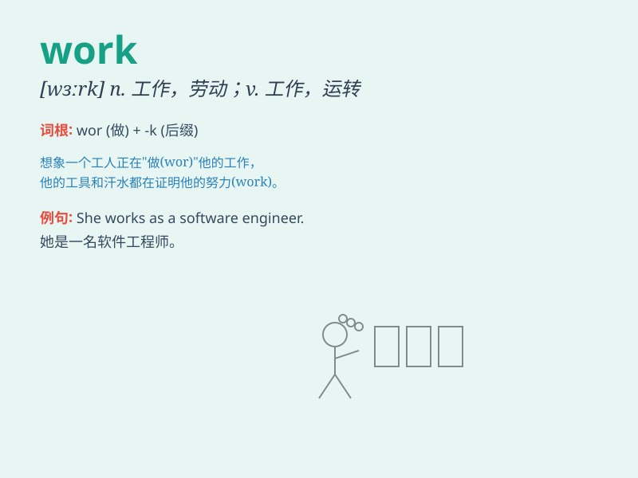

## work

**英音:** _[wɜːk]_ **美音:** _[wɝk]_

**译义:**
*n.工作,劳动,操作,职业,[物]功,手工,作品,机件v.(使)工作,(使)运转,起作用,造成,产生,经营,(使)渐渐移动,煅制*

### 短语

+ **work hard:** _努力工作_

+ **work out:** _解决；算出；实现；制定出_

+ **work on:** _从事于；致力于_

+ **at work:** _在工作；上班_

+ **out of work:** _失业_

### 例句

#### 例句1

> **I go to work at eight o\'clock every morning.**

**中文翻译:** 我每天早上八点去上班。

**单词释义:** 工作；上班

#### 例句2

> **This machine doesn\'t work.**

**中文翻译:** 这台机器坏了。

**单词释义:** 运转；运行

#### 例句3

> **She works hard to achieve her goals.**

**中文翻译:** 她努力工作以实现她的目标。

**单词释义:** 工作；劳动

### 背诵小故事

> One day, Tom got up early and went to work. He spent the whole day
typing on the computer and meeting clients. It was a lot of work, but he
felt fulfilled at the end of the day.

**一天，汤姆早早起床去工作。他一整天都在电脑上打字和会见客户。工作很多，但一天结束时他感到很满足。**

### 图义

