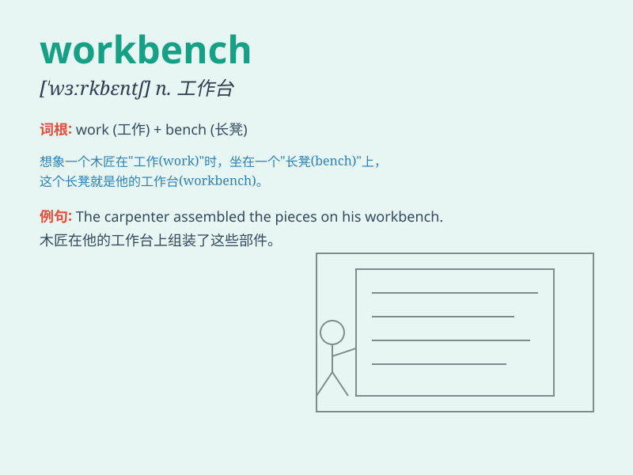

## workbench

**英音:** _[\'wɜːkben(t)ʃ]_ **美音:** _[\'wɝkbɛntʃ]_

**译义:** *n.工作台,手工台*

### 短语

+ **wooden workbench:** _木制工作台_

+ **metal workbench:** _金属工作台_

+ **portable workbench:** _便携式工作台_

+ **professional workbench:** _专业工作台_

+ **adjustable workbench:** _可调节工作台_

### 例句

#### 例句1

> **The carpenter was busy working at his workbench.**

**中文翻译:** 这位木匠正忙着在他的工作台上工作。

**单词释义:** 工作台

#### 例句2

> **She placed the tools neatly on the workbench before starting the
project.**

**中文翻译:** 在开始这个项目之前，她把工具整齐地放在工作台上。

**单词释义:** 工作台

#### 例句3

> **The mechanic\'s workbench was cluttered with various car
parts.**

**中文翻译:** 这位机械师的工作台堆满了各种各样的汽车零件。

**单词释义:** 工作台

### 背诵小故事

> One day, Tom was in his workshop. He needed to fix a broken chair, so
he sat at the workbench and started working. With tools all around, he
concentrated and finally fixed the chair. The workbench was his helper.

**有一天，汤姆在他的工作室里。他需要修理一把坏掉的椅子，于是他坐在工作台前开始工作。周围都是工具，他全神贯注，最后修好了椅子。工作台是他的好帮手。**

### 图义

