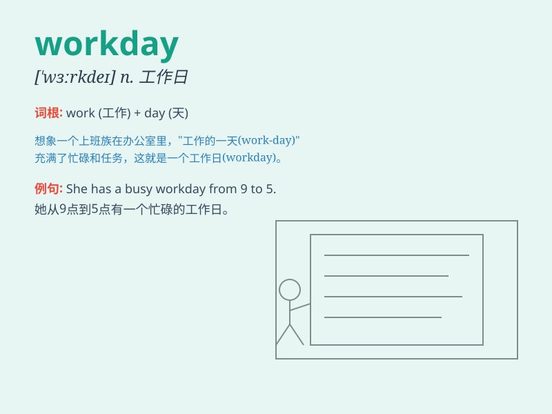

## workday

**英音:** _[\'wɜːkdeɪ]_ **美音:** _[\'wɝkde]_

**译义:** *n.工作日*

### 短语

+ **workday morning:** _工作日的上午_

+ **typical workday:** _典型的工作日_

+ **long workday:** _漫长的工作日_

+ **workday routine:** _工作日的常规_

+ **busy workday:** _繁忙的工作日_

### 例句

#### 例句1

> **I have a busy workday ahead of me.**

**中文翻译:** 我面前有一个繁忙的工作日。

**单词释义:** 工作日

#### 例句2

> **The workday usually starts at nine o\'clock.**

**中文翻译:** 工作日通常九点开始。

**单词释义:** 工作日

#### 例句3

> **After a long workday, she was exhausted.**

**中文翻译:** 在漫长的工作日之后，她筋疲力尽。

**单词释义:** 工作日

### 背诵小故事

> One day, Tom was very tired after a long workday. He had to finish
many tasks at work. But he knew a hard workday would lead to success.
So, he kept going.

**有一天，汤姆在漫长的工作日后非常疲惫。他在工作中必须完成很多任务。但他知道努力工作的一天会带来成功。所以，他坚持下去。**

### 图义

