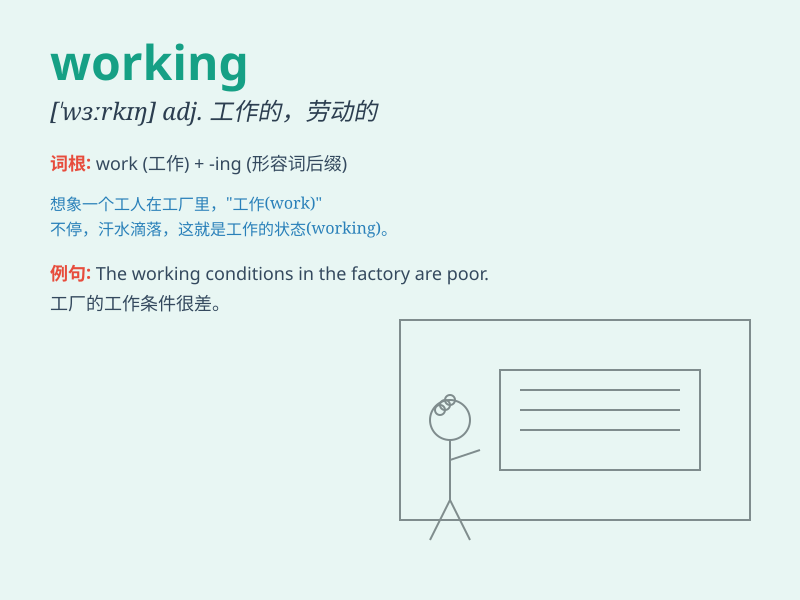

## working

**英音:** _[\'wɜːkɪŋ]_ **美音:** _[\'wɝkɪŋ]_

**译义:**
*n.工作,工作方式,劳动adj.工作的,劳动的,经营的,抽搐的,施工用的,运转的*

### 短语

+ **working day:** _工作日_

+ **working hours:** _工作时间_

+ **working conditions:** _工作条件_

+ **working class:** _工人阶级_

+ **working party:** _工作小组_

### 例句

#### 例句1

> **I\'m working on a new project at the moment.**

**中文翻译:** 我此刻正在做一个新项目。

**单词释义:** 工作；从事

#### 例句2

> **The machine has been working non-stop for three days.**

**中文翻译:** 这台机器已经不停地运转了三天。

**单词释义:** 运转；运行

#### 例句3

> **She has a working knowledge of French.**

**中文翻译:** 她具备有用的法语知识。

**单词释义:** 有效的；可行的

### 背诵小故事

> One day, Tom was working hard in the office. He was typing on the
computer and answering calls. His working state was so concentrated that
he forgot the time. Finally, he finished the task successfully.

**有一天，汤姆在办公室努力工作。他在电脑上打字和接听电话。他工作的状态非常专注以至于忘了时间。最终，他成功完成了任务。**

### 图义

