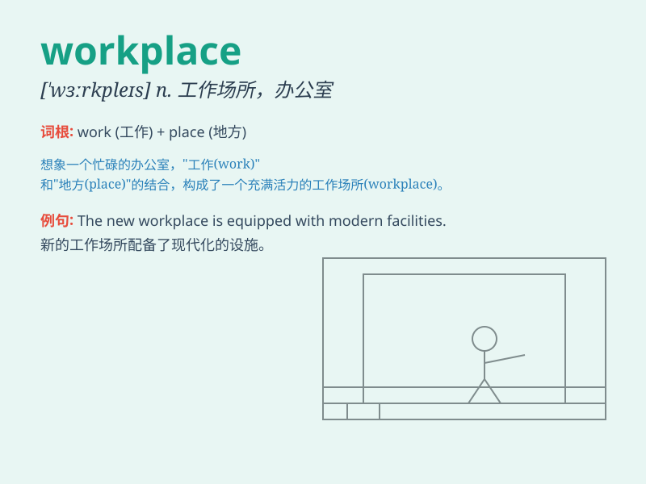

## workplace

**英音:** _[ˈwɜːkpleɪs]_ **美音:** _[ˈwɝːkpleɪs]_

**译义:** *n. 工作场所, 工作地点*

### 短语

+ **workplace safety:** _工作场所安全_

+ **workplace environment:** _工作场所环境_

+ **workplace stress:** _工作场所压力_

+ **workplace culture:** _工作场所文化_

+ **workplace conflict:** _工作场所冲突_

### 例句

#### 例句1

> **The workplace is usually quiet and conducive to
concentration.**

**中文翻译:** 工作场所通常很安静，有利于集中注意力。

**单词释义:** 工作场所

#### 例句2

> **She felt stressed in the competitive workplace.**

**中文翻译:** 她在竞争激烈的工作场所感到有压力。

**单词释义:** 工作场所

#### 例句3

> **Health and safety regulations must be followed in the
workplace.**

**中文翻译:** 在工作场所必须遵守健康和安全规定。

**单词释义:** 工作场所

### 背诵小故事

> One day, Tom was lost. A kind lady asked him where he needed to go.
Tom said he was looking for the workplace. The lady pointed him to a big
building and said, \'That\'s it!\'

**一天，汤姆迷路了。一位善良的女士问他要去哪里。汤姆说他正在找工作场所。女士指向一座大楼说：'就是那儿！'**

### 图义

