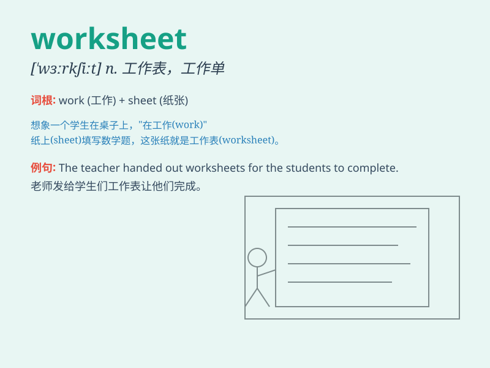

## worksheet

**英音:** _[\'wɜːkʃiːt]_ **美音:** _[\'wɝkʃit]_

**译义:** *工作表*

### 短语

+ **math worksheet:** _数学练习册_

+ **language worksheet:** _语言练习纸_

+ **vocabulary worksheet:** _词汇练习表_

+ **handwriting worksheet:** _书写练习页_

+ **grammar worksheet:** _语法练习单_

### 例句

#### 例句1

> **The teacher handed out a new worksheet for us to complete.**

**中文翻译:** 老师发给我们一份新的作业纸让我们完成。

**单词释义:** 作业纸；活页练习题

#### 例句2

> **I spent the whole afternoon working on this math worksheet.**

**中文翻译:** 我花了整个下午做这张数学作业纸。

**单词释义:** 作业纸；活页练习题

#### 例句3

> **The worksheet contains various types of questions to test our
knowledge.**

**中文翻译:** 这份作业纸包含各种类型的问题来测试我们的知识。

**单词释义:** 作业纸；活页练习题

### 背诵小故事

> A student was very worried about his worksheet. But when he started
to do it carefully, step by step, he found it not that difficult.
Finally, he finished the worksheet successfully and felt proud.

**一个学生对他的作业单非常担心。但当他开始一步一步认真去做时，他发现并没有那么难。最后，他成功地完成了作业单，并感到很自豪。**

### 图义

