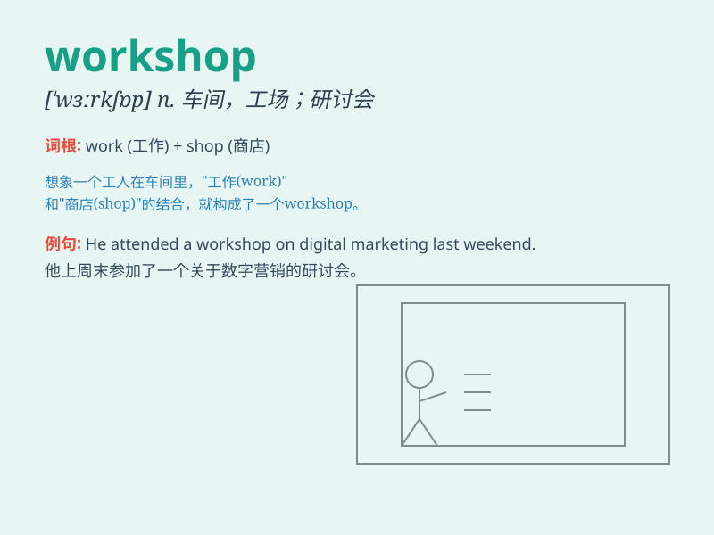

## workshop

**英音:** _[\'wɜːkʃɒp]_ **美音:** _[\'wɝkʃɑp]_

**译义:** *n.车间,工场*

### 短语

+ **workshop manual:** _车间手册；工作间手册_

+ **workshop practice:** _车间实践；工场实习_

+ **workshop equipment:** _车间设备；工作间设备_

+ **workshop floor:** _车间地面；工作场地_

+ **art workshop:** _艺术工作室；美术工作坊_

### 例句

#### 例句1

> **The car factory is holding a workshop to improve production
efficiency.**

**中文翻译:** 这家汽车厂正在举办一个研讨会来提高生产效率。

**单词释义:** 研讨会

#### 例句2

> **She spent the weekend in her pottery workshop.**

**中文翻译:** 她周末在她的陶艺工作室度过。

**单词释义:** 工作室

#### 例句3

> **The workshop has all the necessary tools for woodworking.**

**中文翻译:** 这个车间拥有所有木工所需的工具。

**单词释义:** 车间

### 背诵小故事

> One day, Tom was invited to a workshop. There, people were working
hard to create beautiful handicrafts. Tom saw how they worked and
learned a lot. He realized that a workshop is a place where people work
and create.

**一天，汤姆被邀请去一个工作室。在那里，人们正在努力制作精美的手工艺品。汤姆看到了他们的工作过程，学到了很多。他明白了工作室就是人们工作和创造的地方。**

### 图义

