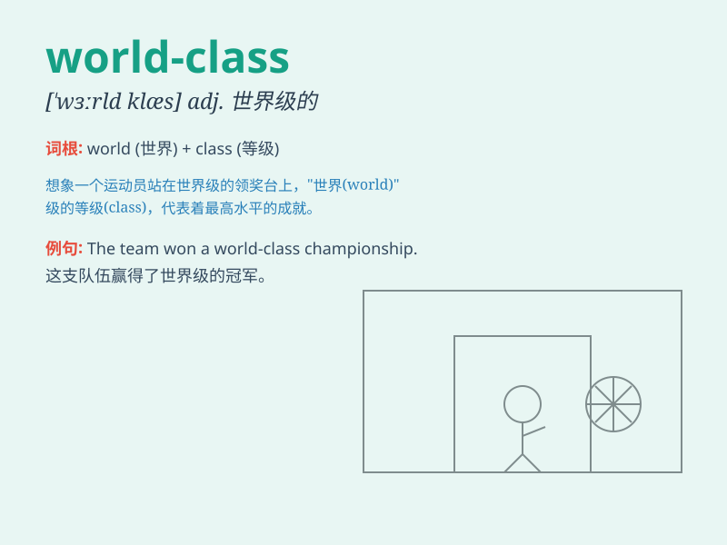

## world-class

**英音:** _[wɜːld klɑːs]_ **美音:** _[wɜːrld klæs]_

**译义:** *adj.世界级的；世界一流的；世界水平的*

### 短语

+ **world-class athlete:** _世界级运动员_

+ **world-class performance:** _世界级表现_

+ **world-class facility:** _世界级设施_

+ **world-class standard:** _世界级标准_

+ **world-class city:** _世界级城市_

### 例句

#### 例句1

> **The athlete is considered world-class for his outstanding
performance.**

**中文翻译:** 这位运动员因其出色的表现被认为是世界级的。

**单词释义:**
世界级的；世界一流的（用于形容某人或某物在全球范围内具有极高的水平或品质）

#### 例句2

> **This company has a world-class research and development team.**

**中文翻译:** 这家公司拥有一支世界级的研发团队。

**单词释义:** 世界级的；世界一流的（强调团队在全球范围内的卓越性）

#### 例句3

> **The museum houses a collection of world-class artworks.**

**中文翻译:** 这个博物馆收藏了一批世界级的艺术品。

**单词释义:** 世界级的；世界一流的（描述艺术品具有极高的价值和品质）

### 背诵小故事

> Imagine a world where only the best athletes compete. They are not
just good but world-class. They shine on the global stage, representing
the highest level. \'World-class\' means being among the best in the
entire world.

**想象一个只有最优秀运动员参加比赛的世界。他们不只是优秀，而是世界级的。他们在全球舞台上闪耀，代表着最高水平。'world-class'意思是世界级的，属于世界上最优秀的。**

### 图义

