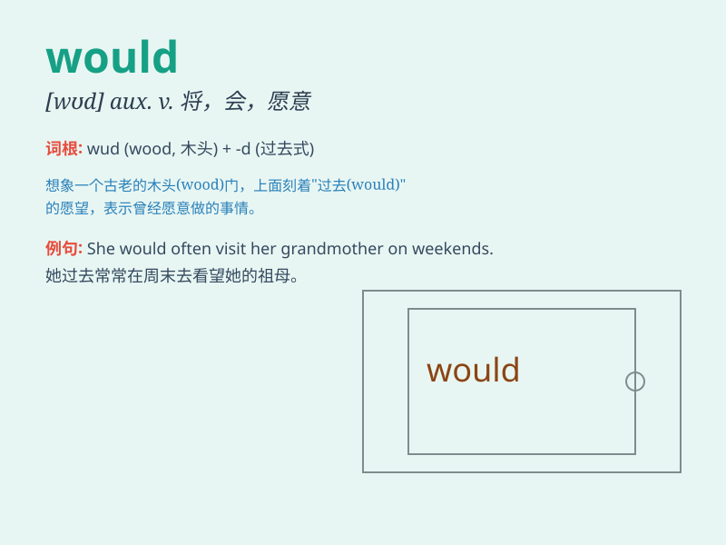

## would

**英音:** _[wʊd; wəd]_ **美音:** _[wʊd; wəd]_

**译义:** *v.aux.will的过去式,将,愿意*

### 短语

+ **would like:** _想要；愿意_

+ **would rather:** _宁愿；宁可_

+ **would have:** _（表示与过去事实相反的虚拟语气）本来会_

+ **would you:** _你愿意；你会_

+ **would do:** _愿意做；会做_

### 例句

#### 例句1

> **I would love to go on vacation next month.**

**中文翻译:** 我下个月很想去度假。

**单词释义:** 愿意；想要

#### 例句2

> **If I were you, I would do it differently.**

**中文翻译:** 如果我是你，我会以不同的方式做这件事。

**单词释义:** 会（用于虚拟语气）

#### 例句3

> **He said he would come, but he didn\'t.**

**中文翻译:** 他说他会来，但他没来。

**单词释义:** 将；将要

### 背诵小故事

> Once upon a time, a little boy always said \'I would like to have a
big cake.\' It means he had a wish or intention. So, \'would\' shows a
kind of possibility or desire.

**从前，有个小男孩总是说'我想要一个大蛋糕。'这意味着他有一个愿望或意向。所以，'would'表示一种可能性或愿望。**

### 图义

