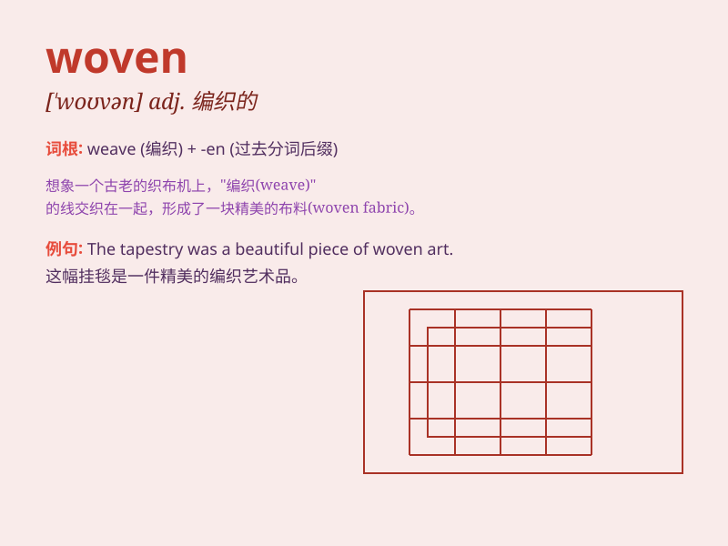

## woven

**英音:** _[\'wəʊvn]_ **美音:** _[\'wovn]_

**译义:** *vbl.weave的过去分词n.机织织物*

### 短语

+ **woven fabric:** _机织织物；纺织物_

+ **woven basket:** _编织篮；柳条篮_

+ **woven carpet:** _编织地毯_

+ **woven label:** _织唛；织标_

+ **woven rope:** _编织绳_

### 例句

#### 例句1

> **The chair is made of woven bamboo.**

**中文翻译:** 这把椅子是由编织的竹子制成的。

**单词释义:** 编织的

#### 例句2

> **She wore a beautiful woven scarf.**

**中文翻译:** 她戴着一条漂亮的编织围巾。

**单词释义:** 编织的

#### 例句3

> **The woven fabric is very soft and comfortable.**

**中文翻译:** 这种编织的织物非常柔软舒适。

**单词释义:** 编织的

### 背诵小故事

> A beautiful princess was given a woven scarf as a gift. The scarf was
made of fine threads, intricately woven together. It was so soft and
warm, just like a magical charm. The word \'woven\' means made by
weaving.

**一位美丽的公主收到了一条编织的围巾作为礼物。这条围巾由精细的线编织而成，交织得十分复杂。它柔软又温暖，就像一个神奇的符咒。\'woven\'这个单词的意思是通过编织制成的。**

### 图义

