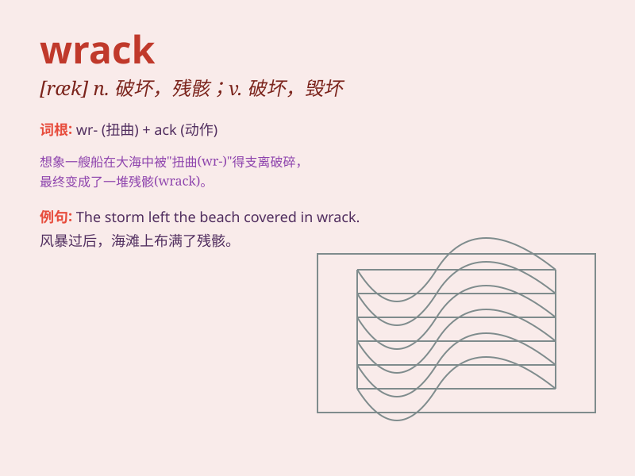

## wrack

**英音:** _[ræk]_ **美音:** _[ræk]_

**译义:** *n.失事船只,破坏vt.完全毁坏*

### 短语

+ **wrack and ruin:** _严重破坏；毁坏；毁灭_

+ **nerve wrack:** _神经紧张；极度焦虑_

+ **wrack one\'s brain:** _绞尽脑汁；苦苦思索_

+ **sea wrack:** _海草；漂积海草_

+ **wrack with pain:** _因痛苦而备受折磨_

### 例句

#### 例句1

> **The storm left the coastline in wrack and ruin.**

**中文翻译:** 风暴使海岸线一片狼藉。

**单词释义:** 破坏；毁坏

#### 例句2

> **Years of stress and overwork had taken their wrack on her
health.**

**中文翻译:** 多年的压力和过度工作损害了她的健康。

**单词释义:** 损害；伤害

#### 例句3

> **The old building was a wrack of its former self.**

**中文翻译:** 这座旧建筑已破败不堪，不复昔日模样。

**单词释义:** 破败；废墟

### 背诵小故事

> A ship was sailing on the sea. Suddenly, a storm came and the ship
was wracked. All the goods on it were scattered. Poor sailors had a hard
time. Remember, wrack means to cause severe damage or destruction.

**一艘船在海上航行。突然，一场风暴袭来，船被严重毁坏。船上所有的货物都散落了。可怜的水手们经历了艰难的时刻。记住，wrack
意思是造成严重破坏或毁坏。**

### 图义

