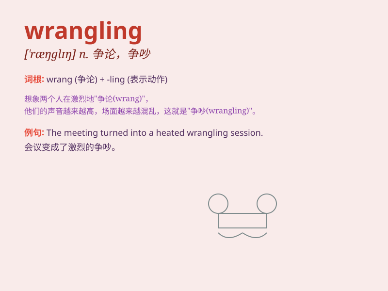

## wrangling

**英音:** _[ˈræŋɡlɪŋ]_ **美音:** _[ˈræŋɡlɪŋ]_

**译义:** *n.争吵；争论；争辩 v.（长时间）争吵，争论*

### 短语

+ **political wrangling:** _政治角力_

+ **intense wrangling:** _激烈的争论_

+ **endless wrangling:** _无休止的争吵_

+ **family wrangling:** _家庭纷争_

+ **legal wrangling:** _法律纠纷_

### 例句

#### 例句1

> **The politicians are engaged in endless wrangling over the
budget.**

**中文翻译:** 政客们就预算问题进行着无休止的争论。

**单词释义:** 争论；争吵

#### 例句2

> **The two companies are in a legal wrangling over the patent
rights.**

**中文翻译:** 这两家公司正因专利权陷入法律纠纷。

**单词释义:** 纠纷；争执

#### 例句3

> **They spent hours wrangling about the details of the plan.**

**中文翻译:** 他们花了数小时为计划的细节争论不休。

**单词释义:** 争论；争辩

### 背诵小故事

> Two farmers were constantly wrangling over the ownership of a piece
of land. They argued loudly and fiercely, but finally, a wise old man
came and helped them solve the problem.

**两个农民一直在为一块土地的所有权而争吵不休。他们大声且激烈地争论，但最后，一位睿智的老人前来帮助他们解决了问题。**

### 图义

