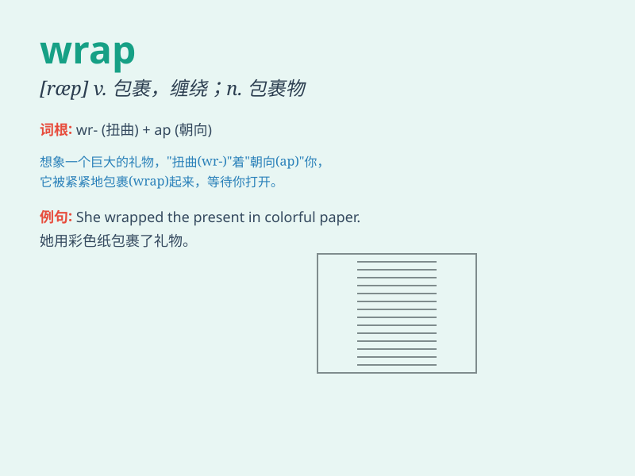

## wrap

**英音:** _[ræp]_ **美音:** _[ræp]_

**译义:**
*n.外套,围巾,包裹,秘密,约束,限制vt.包装,卷,缠绕,包,覆盖,裹,遮蔽,隐藏vi.缠绕,重叠,穿外衣,包起来*

### 短语

+ **wrap up:** _完成；结束；包裹；穿得暖和_

+ **wrap around:** _环绕；包围；缠绕_

+ **under wraps:** _保密；隐藏_

+ **wrap oneself in:** _沉浸于；专心致志于_

+ **gift wrap:** _礼品包装_

### 例句

#### 例句1

> **She wrapped the gift in colorful paper.**

**中文翻译:** 她用彩色纸把礼物包起来。

**单词释义:** 包；裹

#### 例句2

> **The scarf wrapped tightly around her neck to keep her warm.**

**中文翻译:** 围巾紧紧地围在她的脖子上为她保暖。

**单词释义:** 围；绕

#### 例句3

> **He wrapped himself in a blanket and fell asleep on the sofa.**

**中文翻译:** 他用毯子把自己裹起来，在沙发上睡着了。

**单词释义:** 用......包裹

### 背诵小故事

> One cold winter day, I decided to wrap myself in a thick blanket to
keep warm. I carefully folded and covered my body, just like how we
\'wrap\' a gift neatly. It made me feel cozy and protected.

**在一个寒冷的冬日，我决定用一条厚毯子把自己包裹起来保暖。我仔细地折叠并覆盖住身体，就像我们整齐地'包裹'礼物一样。这让我感到舒适又有安全感。**

### 图义

