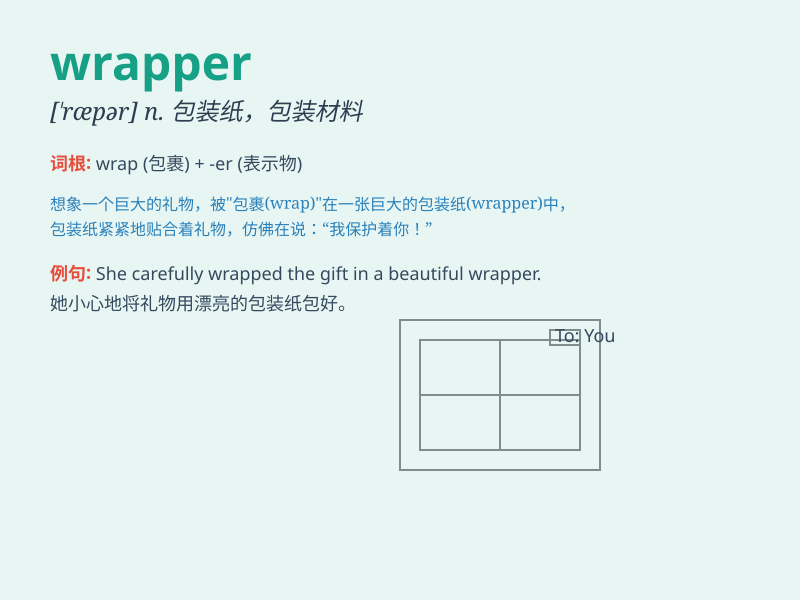

## wrapper

**英音:** _[\'ræpə]_ **美音:** _[\'ræpɚ]_

**译义:** *n.包装材料,包装纸,书皮*

### 短语

+ **gift wrapper:** _礼品包装纸_

+ **wrapper class:** _包装类_

+ **plastic wrapper:** _塑料包装纸_

+ **candy wrapper:** _糖果包装纸_

+ **food wrapper:** _食品包装纸_

### 例句

#### 例句1

> **The chocolate bar was wrapped in a colorful wrapper.**

**中文翻译:** 这块巧克力棒被包裹在一个彩色的包装纸里。

**单词释义:** 包装纸；封套

#### 例句2

> **The software comes with a wrapper that simplifies the
installation process.**

**中文翻译:** 这个软件带有一个简化安装过程的包装程序。

**单词释义:** 包装程序；外壳

#### 例句3

> **She removed the wrapper from the gift carefully.**

**中文翻译:** 她小心地把礼物的包装纸拿掉。

**单词释义:** 包装材料；包装纸

### 背诵小故事

> Imagine a birthday party. The gift is beautifully covered with a
colorful paper. This paper is the \'wrapper\'. It hides and protects the
gift inside, making it a mystery and a surprise.

**想象一个生日聚会。礼物被一张彩色的纸漂亮地包裹着。这张纸就是\'wrapper\'（包装纸；包装材料）。它隐藏并保护着里面的礼物，使其充满神秘和惊喜。**

### 图义

