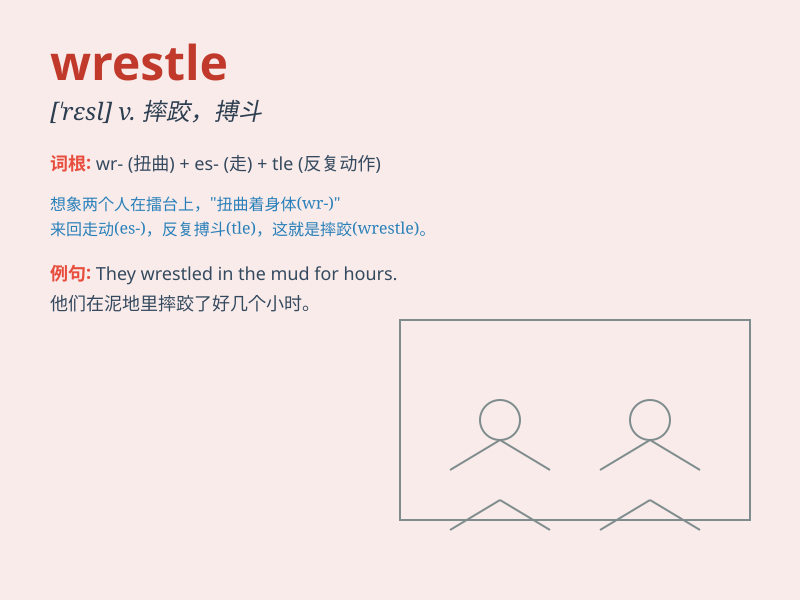

## wrestle

**英音:** _[\'res(ə)l]_ **美音:** _[\'rɛsl]_

**译义:**
*n.摔跤,角力,扭斗vi.摔跤,格斗,斗争,斟酌vt.与(对手)摔跤,使劲搬动*

### 短语

+ **wrestle with:** _努力克服；全力对付_

+ **wrestle to the ground:** _摔倒在地；把...摔倒在地_

+ **wrestle free:** _挣脱_

+ **wrestle for:** _为...而斗争_

+ **wrestle in the mud:** _在泥地里摔跤_

### 例句

#### 例句1

> **He wrestled with the difficult math problem for hours.**

**中文翻译:** 他与这道数学难题搏斗了好几个小时。

**单词释义:** 努力解决；全力对付

#### 例句2

> **The two wrestlers wrestled fiercely in the ring.**

**中文翻译:** 这两名摔跤手在赛场上激烈地摔跤。

**单词释义:** 摔跤；角力

#### 例句3

> **She wrestled the heavy box into the corner.**

**中文翻译:** 她把那个沉重的箱子拖到角落里。

**单词释义:** 用力移动；使劲搬动

### 背诵小故事

> One day, Tom was at the fair and saw two strong men trying to wrestle
each other to the ground. They struggled hard, using all their strength
and skills. Finally, one of them won the wrestle match.

**有一天，汤姆在集市上看到两个强壮的男人试图把对方摔倒在地。他们努力搏斗，用尽了所有的力量和技巧。最后，其中一人赢得了这场摔跤比赛。**

### 图义

