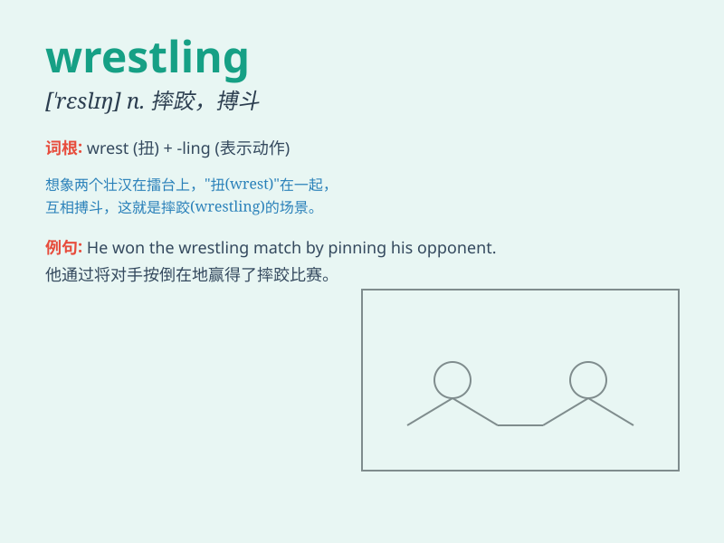

## wrestling

**英音:** _[\'reslɪŋ]_ **美音:** _[\'rɛslɪŋ]_

**译义:** *n.[体]摔跤*

### 短语

+ **professional wrestling:** _职业摔跤_

+ **wrestling match:** _摔跤比赛_

+ **wrestling ring:** _摔跤场_

+ **wrestling hold:** _摔跤擒拿法_

+ **wrestling team:** _摔跤队_

### 例句

#### 例句1

> **He is passionate about wrestling and practices every day.**

**中文翻译:** 他热衷于摔跤并且每天都练习。

**单词释义:** 摔跤（运动）

#### 例句2

> **The wrestling match attracted a large crowd.**

**中文翻译:** 这场摔跤比赛吸引了大批观众。

**单词释义:** 摔跤（比赛）

#### 例句3

> **She learned some wrestling techniques from her coach.**

**中文翻译:** 她从教练那里学到了一些摔跤技巧。

**单词释义:** 摔跤（技巧）

### 背诵小故事

> One day, Tom and Jerry had a wrestling match. They struggled and
fought hard. Tom tried to throw Jerry down, but Jerry was very flexible
and resisted. Finally, it was a close call. Remember, this is wrestling!

**有一天，汤姆和杰瑞进行了一场摔跤比赛。他们奋力搏斗。汤姆试图把杰瑞摔倒，但杰瑞非常灵活并抵抗着。最终，难分胜负。记住，这就是摔跤！**

### 图义

