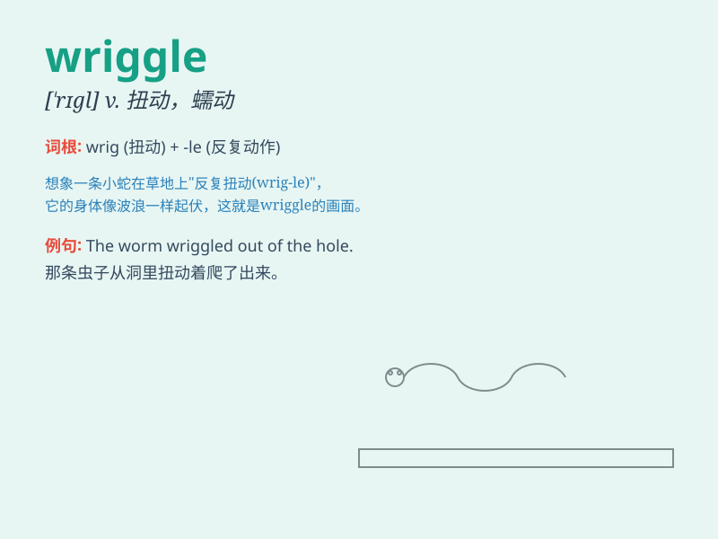

## wriggle

**英音:** _[\'rɪg(ə)l]_ **美音:** _[\'rɪɡl]_

**译义:** *v.宛蜒行进,扭动*

### 短语

+ **wriggle out:** _设法逃避；摆脱_

+ **wriggle through:** _扭动着通过_

+ **wriggle free:** _挣脱；摆脱束缚_

+ **wriggle around:** _到处扭动_

+ **wriggle into:** _扭动着进入_

### 例句

#### 例句1

> **The worm wriggled across the ground.**

**中文翻译:** 这条虫子在地上扭动着爬过去。

**单词释义:** 扭动，蠕动

#### 例句2

> **The baby wriggled out of her mother\'s arms.**

**中文翻译:** 宝宝从妈妈的怀抱中扭动着挣脱出来。

**单词释义:** 扭动，挣脱

#### 例句3

> **He tried to wriggle free from the ropes.**

**中文翻译:** 他试图从绳索中扭动着挣脱出来。

**单词释义:** 扭动，摆脱

### 背诵小故事

> A little worm was trying to cross the road. It wriggled left and
right to avoid being stepped on. Finally, it made it safely to the other
side. The worm\'s wriggling movement was so funny!

**一只小虫子正努力过马路。它左右扭动以避免被踩到。最终，它安全地到达了另一边。这只虫子扭动的动作太有趣了！**

### 图义

