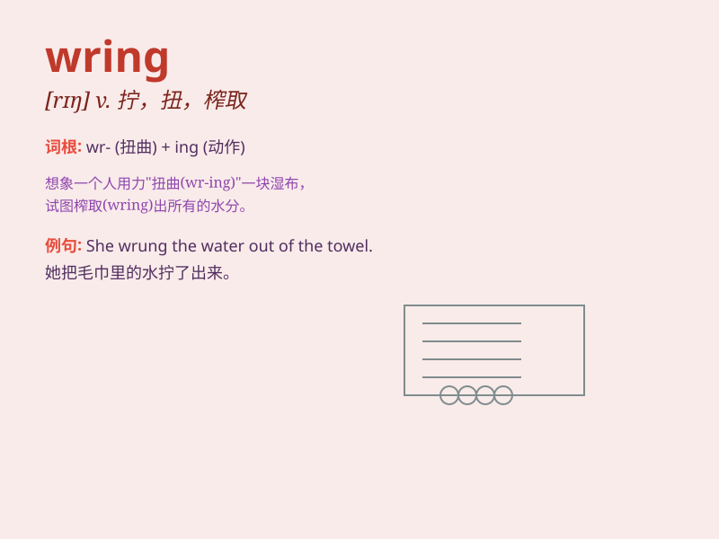

## wring

**英音:** _[rɪŋ]_ **美音:** _[rɪŋ]_

**译义:** *v.绞,扭,榨取,强求,折磨,扭绞n.绞,挤,榨,扭动*

### 短语

+ **wring out:** _拧干；绞出_

+ **wring one\'s hands:** _搓手（尤指焦急、难过或绝望时）_

+ **wring the neck of:** _扭断...的脖子；扼杀_

+ **wring money from:** _从...榨取钱财_

+ **wring consent from:** _强迫...同意_

### 例句

#### 例句1

> **She wrung the wet towel dry.**

**中文翻译:** 她把湿毛巾拧干。

**单词释义:** 拧，绞

#### 例句2

> **He wrung his hands in despair.**

**中文翻译:** 他绝望地搓着双手。

**单词释义:** 扭动，绞动

#### 例句3

> **The woman wrung a confession out of the thief.**

**中文翻译:** 那个女人迫使小偷招供。

**单词释义:** 逼迫，强迫

### 背诵小故事

> A thief was caught stealing. The angry owner tried to wring the
thief\'s neck. But in the end, he just wrung the thief\'s arm to teach
him a lesson.

**一个小偷在行窃时被抓住了。愤怒的主人试图拧断小偷的脖子。但最后，他只是拧了小偷的胳膊来教训他。**

### 图义

