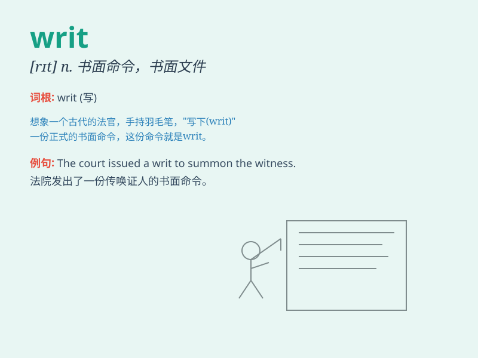

## writ

**英音:** _[rɪt]_ **美音:** _[rɪt]_

**译义:** *n.文书,正式文件,书面命令*

### 短语

+ **writ large:** _显而易见；清楚地表现出来_

+ **writ of summons:** _传票_

+ **writ of execution:** _执行令_

+ **writ of habeas corpus:** _人身保护令_

+ **writ of certiorari:** _调卷令_

### 例句

#### 例句1

> **The court issued a writ of summons.**

**中文翻译:** 法院发出了传票。

**单词释义:** 书面命令；传票

#### 例句2

> **He was served with a writ for non-payment of debt.**

**中文翻译:** 他因未偿还债务而收到了传票。

**单词释义:** 传票

#### 例句3

> **The king\'s writ ran throughout the land.**

**中文翻译:** 国王的命令在全国通行。

**单词释义:** （国王的）命令

### 背诵小故事

> A king sent a writ to his knights, commanding them to come to the
castle immediately. The writ was a powerful order that must be obeyed.

**一位国王给他的骑士们发送了一份令状，命令他们立即来到城堡。这份令状是一个必须遵守的强有力的命令。**

### 图义

