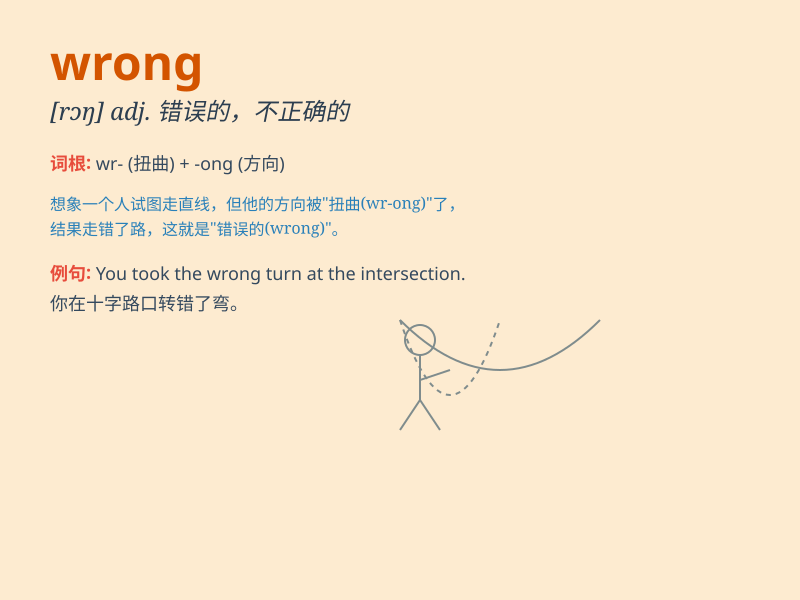

## wrong

**英音:** _[rɒŋ]_ **美音:** _[rɔŋ]_

**译义:**
*adj.错误的,不正当的,道德不好的,失常的adv.错误地n.坏事,错误,不公正*

### 短语

+ **go wrong:** _出毛病；弄错；发生故障_

+ **in the wrong:** _有错；应承担责任_

+ **wrong number:** _错号；错误号码_

+ **do wrong:** _作恶；犯罪；做错事_

+ **wrong side out:** _里面朝外；表里倒置_

### 例句

#### 例句1

> **You are wrong. I never said that.**

**中文翻译:** 你错了。我从未那样说过。

**单词释义:** 错误的；不正确的

#### 例句2

> **What\'s wrong with your bike?**

**中文翻译:** 你的自行车怎么了？

**单词释义:** 有毛病；不正常

#### 例句3

> **He went the wrong way.**

**中文翻译:** 他走错路了。

**单词释义:** 错误的；不正确的

### 背诵小故事

> One day, Tom took the wrong book to school. His teacher pointed out
his mistake and said, \'This is wrong, Tom. You should bring the right
one.\' Tom felt embarrassed and promised not to make the same mistake
again.

**有一天，汤姆带错了书去学校。他的老师指出了他的错误并说："这是错的，汤姆。你应该带对的那本。"汤姆感到很尴尬，并保证不再犯同样的错误。**

### 图义

