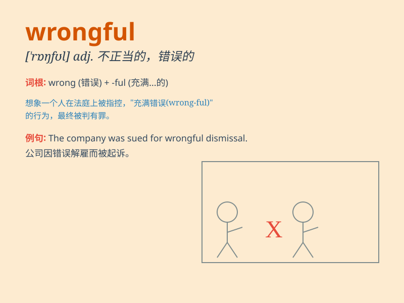

## wrongful

**英音:** _[\'rɒŋfʊl; -f(ə)l]_ **美音:** _[\'rɔŋfl]_

**译义:** *adj.不正当的*

### 短语

+ **wrongful act:** _不法行为；违法行为_

+ **wrongful death:** _非正常死亡；错误致死_

+ **wrongful dismissal:** _不正当解雇；非法解雇_

+ **wrongful imprisonment:** _非法监禁；冤狱_

+ **wrongful conduct:** _不当行为；错误行为_

### 例句

#### 例句1

> **The court found the company guilty of wrongful dismissal.**

**中文翻译:** 法院判定该公司犯有不正当解雇罪。

**单词释义:** 不正当的；非法的

#### 例句2

> **She claimed wrongful arrest and demanded compensation.**

**中文翻译:** 她声称遭到非法逮捕并要求赔偿。

**单词释义:** 错误的；违法的

#### 例句3

> **The wrongful use of public funds is a serious offense.**

**中文翻译:** 不正当使用公共资金是一项严重的罪行。

**单词释义:** 不公正的；不正当的

### 背诵小故事

> A man was wrongly accused of stealing. It was a wrongful judgment.
But finally, the truth came out and he was proved innocent. This shows
how bad a wrongful accusation can be.

**一个男人被错误地指控偷窃。这是一个错误的判决。但最后，真相大白，他被证明是无辜的。这显示了错误的指控是多么糟糕。**

### 图义

