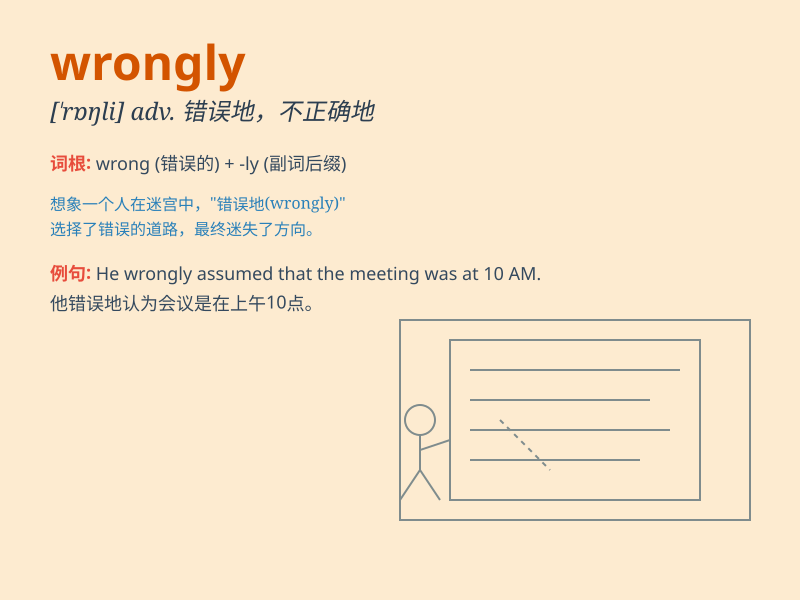

## wrongly

**英音:** _[ˈrɒŋli]_ **美音:** _[ˈrɔːŋli]_

**译义:** *adv.不正当地,错误地*

### 短语

+ **be wrongly accused:** _被错误地指控_

+ **judge wrongly:** _判断错误_

+ **interpret wrongly:** _错误地解释_

+ **assume wrongly:** _错误地假设_

+ **understand wrongly:** _错误地理解_

### 例句

#### 例句1

> **He was wrongly accused of theft.**

**中文翻译:** 他被错误地指控盗窃。

**单词释义:** 错误地

#### 例句2

> **The decision was wrongly made without considering all the
facts.**

**中文翻译:** 这个决定在没有考虑所有事实的情况下被错误地做出了。

**单词释义:** 错误地

#### 例句3

> **She wrongly believed that she could solve the problem alone.**

**中文翻译:** 她错误地认为她可以独自解决这个问题。

**单词释义:** 错误地

### 背诵小故事

> One day, Tom wrongly thought the exam was on Monday, but it was
actually on Tuesday. So he didn\'t prepare well and got a bad grade.
Poor Tom! He understood wrongly and paid the price.

**一天，汤姆错误地认为考试在周一，但实际上是在周二。所以他没有准备好，成绩很差。可怜的汤姆！他理解错误并付出了代价。**

### 图义

